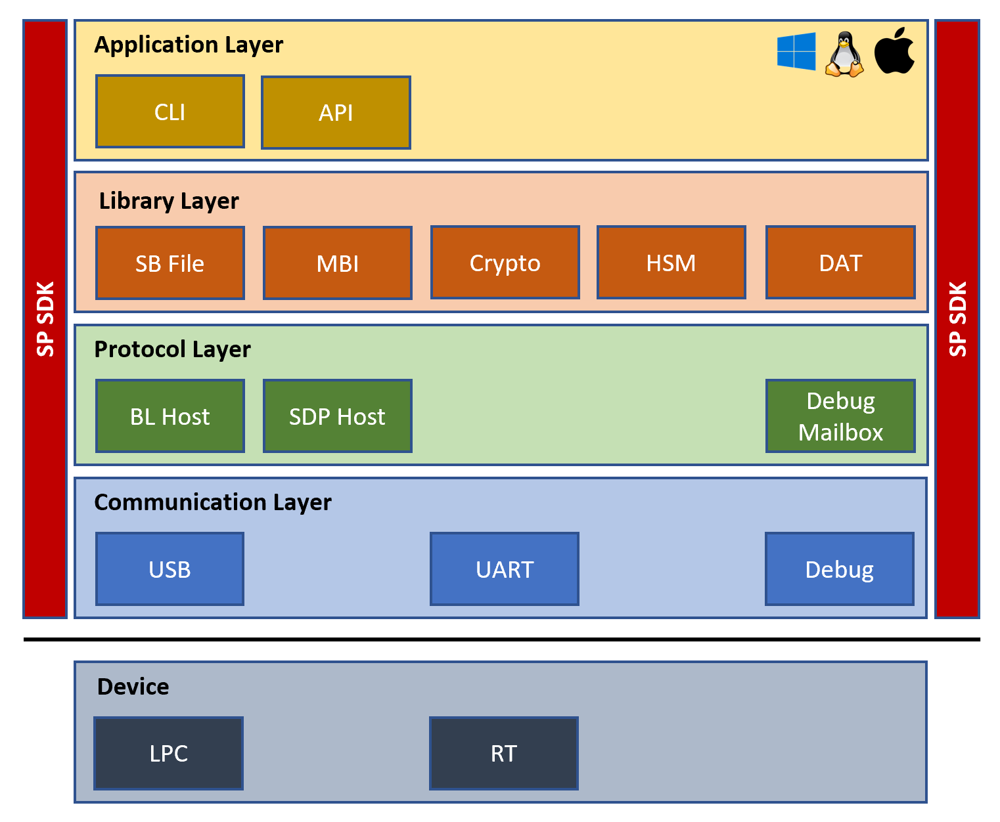

# NXP Secure Provisioning SDK

**Secure Provisioning SDK (SPSDK)** enables connection and communication with target devices for purposes of secure provisioning and programming. Delivered as python library with command-line applications for direct utilization.



## Links

* [PyPi](https://pypi.org/project/spsdk/)
* [Release Notes](release_notes.txt)
* [Documentation](https://spsdk.readthedocs.io)

## Supported Devices

Following NXP devices are supported:

- LPC55 [S6x](https://www.nxp.com/products/processors-and-microcontrollers/arm-microcontrollers/general-purpose-mcus/lpc5500-cortex-m33/high-efficiency-arm-cortex-m33-based-microcontroller-family:LPC55S6x) / [S2x](https://www.nxp.com/products/processors-and-microcontrollers/arm-microcontrollers/general-purpose-mcus/lpc5500-cortex-m33/lpc552x-s2x-mainstream-arm-cortex-m33-based-microcontroller-family:LPC552x-S2x) / [S1x](https://www.nxp.com/products/processors-and-microcontrollers/arm-microcontrollers/general-purpose-mcus/lpc5500-cortex-m33/lpc551x-s1x-baseline-arm-cortex-m33-based-microcontroller-family:LPC551X-S1X) / [S0x](https://www.nxp.com/products/processors-and-microcontrollers/arm-microcontrollers/general-purpose-mcus/lpc5500-cortex-m33/lpc550x-s0x-baseline-arm-cortex-m33-based-microcontroller-family:LPC550x)
- i.MX RT [600](https://www.nxp.com/products/processors-and-microcontrollers/arm-microcontrollers/i-mx-rt-crossover-mcus/i-mx-rt600-crossover-mcu-with-arm-cortex-m33-and-dsp-cores:i.MX-RT600) / [500](https://www.nxp.com/products/processors-and-microcontrollers/arm-microcontrollers/i-mx-rt-crossover-mcus/i-mx-rt500-crossover-mcu-with-arm-cortex-m33-core:i.MX-RT500)
- i.MX RT [1060](https://www.nxp.com/products/processors-and-microcontrollers/arm-microcontrollers/i-mx-rt-crossover-mcus/i-mx-rt1060-crossover-mcu-with-arm-cortex-m7-core:i.MX-RT1060) / [1050](https://www.nxp.com/products/processors-and-microcontrollers/arm-microcontrollers/i-mx-rt-crossover-mcus/i-mx-rt1050-crossover-mcu-with-arm-cortex-m7-core:i.MX-RT1050) / [1020](https://www.nxp.com/products/processors-and-microcontrollers/arm-microcontrollers/i-mx-rt-crossover-mcus/i-mx-rt1020-crossover-mcu-with-arm-cortex-m7-core:i.MX-RT1020) / [1010](https://www.nxp.com/products/processors-and-microcontrollers/arm-microcontrollers/i-mx-rt-crossover-mcus/i-mx-rt1010-crossover-mcu-with-arm-cortex-m7-core:i.MX-RT1010)
- i.MX RT [1170](https://www.nxp.com/products/processors-and-microcontrollers/arm-microcontrollers/i-mx-rt-crossover-mcus/i-mx-rt1170-crossover-mcu-family-first-ghz-mcu-with-arm-cortex-m7-and-cortex-m4-cores:i.MX-RT1170) / 1160 (blhost)

## Supported environments

- Windows 10, 64bit
- Ubuntu 16.04 or above, 64bit
- Mac OS 10.13 or above, x64

## Installation

- Make sure to have [Python](https://www.python.org) 3.6+ installed
- Create a virtual environment (venv, pipenv, etc.)

> SPSDK is tested on Python >3.5 and <3.9 interpreter, old version 2.x is not supported

### PyPi:

``` bash
    pip install spsdk
```

### GitHub:

``` bash
    $ pip install -U https://github.com/NXPmicro/spsdk/archive/master.zip
```

### Sources:

``` bash
    $ git clone https://github.com/NXPmicro/spsdk.git
    $ cd spsdk
    $ pip install -r requirements-develop.txt
    $ pip install -U -e .
```
> In **Windows OS** you need to install [Microsoft Visual C++ Build Tools](https://www.scivision.dev/python-windows-visual-c-14-required/)
 
 Note: In case of problems during instalation, please make sure that you have the latest pip version.
 You can upgrade pip using this command: 'pip install --upgrade pip'.

## Usage

- See [examples](examples) directory
- See [application](spsdk/apps) directory

---
**i.Mx RT 1050**

To run examples using i.MX RT 1050 you need to download a flashloader:
- Go to: https://www.nxp.com/webapp/sps/download/license.jsp?colCode=IMX-RT1050-FLASHLOADER
- Review the license agreement, download and unzip the package
- Convert the elf file into bin (For this operation you need to have MCUXpresso IDE, IAR or Keil)
  - run ```python tools\flashloader_converter.py --elf-path <path/to/flashloader.elf> --ide-type <mcux | iar | keil> --ide-path <path/to/IDE/install/folder```

---

## Dependencies

The core dependencies are included in [requirements.txt](requirements.txt). 

The dependencies for the development and testing are included in [requirements-develop.txt](requirements-develop.txt).
