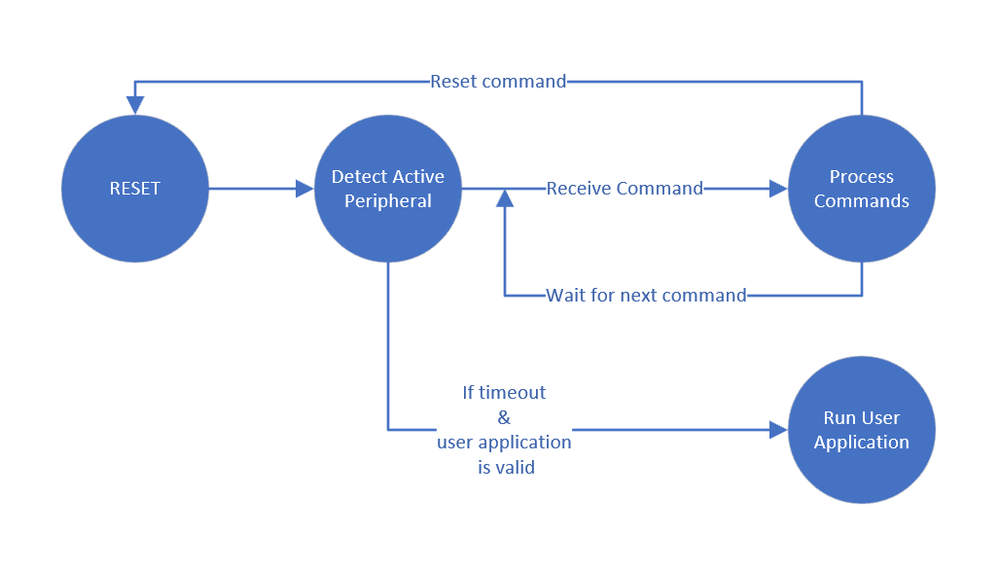

.. |br| raw:: html

    

===================
User Guide - blhost
===================

This user’s guide describes how to interface with the *MCU bootloader* using *blhost* application.

The *blhost* application is a command-line utility used on the host computer to initiate communication and issue commands to the *MCU bootloader*. The application only sends one command per invocation.

-------------
Communication
-------------

The *blhost* application can communicate directly with the *MCU bootloader* over the host computer’s UART (Serial Port) or USB connections.

*MCU bootloader* typically supports other peripherals such as I2C, SPI, and CAN. However, the *blhost* application cannot interface with the MCU bootloader over these transports without external hardware.

blhost - USB
============

*blhost* could be connected to MCU Bootloader over USB HID.

:ref:`USB device identification in SPSDK`

blhost - UART
=============

*blhost* could be connected to MCU bootloader over UART.

:ref:`UART device identification in SPSDK`

blhost - BUSPAL
===============

The BusPal acts as a bus translator running on selected platforms. BusPal assists *blhost* in carrying out commands and responses from the target device through an established connection with *blhost* over UART, and the target device over I2C, SPI, or CAN.

blhost - LPCUSBSIO
==================

LPCUSBSIO - LPC USB Serial I/O(LPCUSBSIO), a firmware built in LPC Link2. The LPCUSBSIO acts as a bus translator, and establishes connection with *blhost* over USB-HID, and the MCU bootloader device over I2C and SPI.

blhost - CAN
============

*blhost* could be connected to MCU bootloader over CAN. Support is based on python-can library. Refer to the documentation of python-can for more information. https://python-can.readthedocs.io/en/stable/
In order to use CAN, extras must be installed with "pip install spsdk[can]".

----------------
 MCU bootloader
----------------

The MCU bootloader is intended to be the standard bootloader for all MCU devices. It provides a standard interface to the device using any of the peripherals supported by the bootloader on a given NXP MCU device.

The MCU bootloader is available as source code for customer and flash-based implementations. There are example applications in the package which demonstrates how to interface with the MCU bootloader.

`MCU Bootloader for NXP Microcontrollers <https://www.nxp.com/design/software/development-software/mcuxpresso-software-and-tools-/mcuboot-mcu-bootloader-for-nxp-microcontrollers:MCUBOOT>`_

MCU bootloader properties
=========================

Current version
---------------

The value of this property is a 4-byte structure containing the current version of the bootloader. This property is encoded in a one-word value.

.. table:: MCU Bootloader - bit ranges for version components
    :align: left

    ======== =============== =============== =============== ===============
    Bit      [31:24]         [23:16]         [15:8]          [7:0]
    Field    Name            Major Version   Minor Version   Bugfix version
    ======== =============== =============== =============== ===============

Available peripherals
---------------------

The value of this property is a one-word bitfield that lists the peripherals supported by the bootloader and the hardware on which it is running.

.. table:: MCU Bootloader - peripheral bits
    :align: left

    =============== =============== =============== =============== =============== =============== ===============
    Bit             5               4               3               2               1               0
    Peripheral      Reserved        USB HID         CAN             SPI Slave       I2C Slave       UART
    =============== =============== =============== =============== =============== =============== ===============

Available commands
------------------

This property value is a bitfield with bits set corresponding to commands enabled in the bootloader.

The bit number that identifies whether a command is present is the command's tag value minus 1. To get the bit mask for a given command, use this expression

.. code:: c

    mask = 1 << (tag - 1)

.. table:: MCU Bootloader - available commands
    :align: left

    ======== ================================
    1        flash-erase-all (0x01)
    2        flash-erase-region (0x02)
    3        read-memory (0x03)
    4        write-memory (0x04)
    5        fill-memory (0x05)
    6        flash-security-disable (0x06)
    7        get-property (0x07)
    8        receive-sb-file (0x08)
    9        execute (0x09)
    10        call (0x0a)
    11       reset (0x0b)
    12       set-property (0x0c)
    13       flash-erase-all-unsecure (0x0d)
    14       flash-program-once (0x0e)
    15       flash-read-once (0x0f)
    16       flash-read-resource (0x10)
    17       configure-memory (0x11)
    18       reliable-update (0x12)
    19       generate-key-blob (0x13)
    20       program-fuse (0x14)
    21       key-provisioning (0x15)
    22       trust-provisioning (0x16)
    23       fuse-read (0x17)
    24       update-life-cycle(0x18)
    [31:25]  reserved
    ======== ================================

MCU Bootloader operation
========================

The correct use of *blhost* program requires a connection to a MCU device running the MCU bootloader command interface. The diagram shows a simplified view of the MCU bootloader state machine that shows the states relevant to *blhost* application.

    Simplified MCU Bootloader state diagram

After reset, the bootloader monitors all enabled peripheral devices, UART, I2C, SPI, CAN, USB-HID, and USB-MSC for active communication. After communication is established, all peripherals except the active peripheral are shut down, and the bootloader enters the command processing state.

If the bootloader is in the “Detect Active Peripheral” state, the first use of *blhost* application establishes the active peripheral and the bootloader transitions to the “Process Commands” state. The active peripheral is established according to the transport used by the initial *blhost* invocation.

For example, if the -u option was successfully used to send the initial command, the USB-HID is the active peripheral and all future commands must use the ``-u`` option unless the bootloader is reset.

If the ``-p COMx`` option is used, the UART is the active peripheral and all future commands must use the ``–p COMx`` option unless the bootloader is reset. For the UART peripheral, the baud rate is automatically determined by the bootloader when processing the initial ping. Therefore, subsequent *blhost* invocations must specify the same baud rate as was used for the initial invocation unless the bootloader is reset. If the baud rate is not specified using the ``-p COMx,<baudrate>`` option, the UART baud rate is set to 57600.

.. note::
    After the MCU bootloader is in the “Process Commands” state, the device has to be reset to communicate over a different peripheral or at a different baud rate over the same UART peripheral.

----------------------
Command line interface
----------------------

*blhost* consist of a set of sub-commands followed by options and arguments.
The options and the sub-command are separated with a ‘--’.

.. code:: bash

    blhost [options] -- [sub-command]

The "help" guide of *blhost* lists all of the options and sub-commands supported by the *blhost* utility.

.. code:: bash

    blhost --help

All sub-commands are not supported on all MCU bootloader platforms. If a sub-command is not supported by the MCU bootloader, it returns ``k_StatusUnknownCommand``.

When flash security is enabled, only the ``get-property``, ``set-property``, ``reset``, ``flash-security-disable``, and ``flash-erase-all-unsecure`` sub-commands are supported. The MCU bootloader returns ``kStatus_SecurityViolation`` if a sub-command is received that is not supported due to flash security settings.

.. click:: spsdk.apps.blhost:main
    :prog: blhost
    :nested: none

.. click:: spsdk.apps.blhost:reset
    :prog: blhost reset
    :nested: full

After the reset the device boots from flash and user image is programmed successfully using ROM bootloader.

.. note::
    After issuing the reset sub-command, allow 5 seconds for the user application to start running from flash.

.. click:: spsdk.apps.blhost:get_property
    :prog: blhost get-property
    :nested: full

.. note::
    Not all properties are supported by all target. To check the supported properties, see the target's user manual or the reference manual.

.. table:: Memory ID

    +-----------------+----------------------------------------------------------------------------+
    | Internal Memory | Device internal memory space                                               |
    +=================+============================================================================+
    | 0               | Internal Memory (Default selected memory)                                  |
    +-----------------+----------------------------------------------------------------------------+
    | 16 (0x10)       | Execute-only region on internal flash (Only used for flash-erase-all)      |
    +-----------------+----------------------------------------------------------------------------+
    | Mapped      |br|| The memories that are remapped to internal space, and must be accessed |br||
    | External    |br|| by internal addresses. (IDs in this group are only used for            |br||
    | Memory          | flash-erase-all and configure-memory, and ignored by write-memory,     |br||
    |                 | read-memory, flash-erase-region and flash-image(use default 0))            |
    +-----------------+----------------------------------------------------------------------------+
    | 1               | QuadSPI Memory                                                             |
    +-----------------+----------------------------------------------------------------------------+
    | 8               | SEMC NOR Memory                                                            |
    +-----------------+----------------------------------------------------------------------------+
    | 9               | FlexSPI NOR Memory                                                         |
    +-----------------+----------------------------------------------------------------------------+
    | 10 (0xa)        | SPIFI NOR Memory                                                           |
    +-----------------+----------------------------------------------------------------------------+
    | Unmapped    |br|| Memories which cannot be remapped to internal space, and only can be   |br||
    | External    |br|| accessed by memories' addresses. (Must be specified for all commands   |br||
    | Memory          | with <memoryId> argument)                                                  |
    +-----------------+----------------------------------------------------------------------------+
    | 256 (0x100)     | SEMC NAND Memory                                                           |
    +-----------------+----------------------------------------------------------------------------+
    | 257 (0x101)     | SPI NAND Memory                                                            |
    +-----------------+----------------------------------------------------------------------------+
    | 272 (0x110)     | SPI NOR/EEPROM Memory                                                      |
    +-----------------+----------------------------------------------------------------------------+
    | 273 (0x111)     | I2C NOR/EEPROM Memory                                                      |
    +-----------------+----------------------------------------------------------------------------+
    | 288 (0x120)     | uSDHC SD Memory                                                            |
    +-----------------+----------------------------------------------------------------------------+
    | 289 (0x121)     | uSDHC MMC Memory                                                           |
    +-----------------+----------------------------------------------------------------------------+

.. click:: spsdk.apps.blhost:set_property
    :prog: blhost set-property
    :nested: full

.. note::
    If an attempt to write a read-only property is made, an error is returned indicating the property is read-only and cannot be changed.

    Properties that can be changed all have 32-bit values.

.. click:: spsdk.apps.blhost:flash_erase_region
    :prog: blhost flash-erase-region
    :nested: full

.. note::
    If the VerifyWrites property is enabled, the sub-command performs a flash verify erase operation.

.. click:: spsdk.apps.blhost:flash_erase_all
    :prog: blhost flash-erase-all
    :nested: full

.. note::
    If any flash regions are protected, the sub-command fails with an error.

    If any flash regions are reserved by the bootloader, they are ignored (not erased).

    If the VerifyWrites property is enabled, the flash-erase-all sub-command performs a flash verify erase all operation, or multiple flash verify erase options if decomposed due to reserved regions.

.. click:: spsdk.apps.blhost:flash_security_disable
    :prog: blhost flash_security_disable
    :nested: full

.. note::
    Performs the flash security disable operation by comparing the provided 8-byte backdoor key against the backdoor key stored in
    the Flash Configuration Field at address 0x400 in flash.

    If the backdoor key comparison fails, further attempts to disable security with this command fails until the system is reset.

    Backdoor key access must be enabled by setting the KEYEN bitfield of the FSEC byte in the Flash Configuration Field to 0b10. It
    is disabled by default. The backdoor key in the Flash Configuration Field must also be set to a value other than all zeros or all ones.

.. click:: spsdk.apps.blhost:read_memory
    :prog: blhost read-memory
    :nested: full

.. note::
    This sub-command can read any region of memory accessible by the CPU and not protected by security.
    This includes flash, RAM, and peripheral registers.

    Note that the minimum profile does not support reading the peripheral register space.

.. click:: spsdk.apps.blhost:write_memory
    :prog: blhost write-memory
    :nested: full

.. note::
    Can write to all accessible memory, including flash, RAM, and peripheral registers. However, if flash protection is enabled, writes to protected sectors fails. Data specified by file is treated as binary data.

    Any flash sector written to must be previously erased with either a flash-erase-all, flash-erase-region, or flash-erase-allunsecure sub-command.

    Writing to flash requires the start address to be word aligned. The byte count is rounded up to a multiple of the word size, and trailing bytes are filled with the flash erase pattern (0xff).

    Word and half-word-aligned and sized writes to RAM and peripheral registers use appropriately sized writes. This enables writing to registers larger than a byte in a single bus transaction.

    Note that the minimum profile does not support writing to the peripheral register space.

    If the VerifyWrites property is enabled, writes to flash performs a flash verify program operation.

.. click:: spsdk.apps.blhost:list_memory
    :prog: blhost list-memory
    :nested: full

.. click:: spsdk.apps.blhost:receive_sb_file
    :prog: blhost receive-sb-file
    :nested: full

.. note::
    The SB file format is described in the documentation for *nxpimage* and can be created using the *nxpimage* tool.

    Note that if the SB file contains a JUMP command, the receive-sb-file sub-command is aborted at the point of the jump, and a status of kStatus_AbortDataPhase is returned.

.. click:: spsdk.apps.blhost:execute
    :prog: blhost execute
    :nested: full

.. warning::

    For LPC55Sxx/K32W1xx/KW45xx/KW47xx/MCXA1xx/MCXA2xx/MCXCxxx/MCXNx3x/MCXN23x/MCXW7xx/RW61x/RT6xx/RT5xx

    ADDRESS – should be set to initial PC value of the image to be executed. You can read the value from the binary of the application image (second 32-bit word in the application binary)

    ARGUMENT – image start address (location in memory where the image is loaded)

    STACKPOINTER – should be set to initial SP value of the image to be executed. You can read the value from the binary of the application image (first 32-bit word in the application binary)

.. note::
    The effective prototype of the called function is:

    .. code:: C

        void function(uint32_t arg);

.. click:: spsdk.apps.blhost:call
    :prog: blhost call
    :nested: full

.. note::
    The function that is called has the same prototype as for the one called by the execute command.

    Because the intention is to return to the bootloader after the function executes, the function must not perform any action that would interfere with the bootloader operation. In particular, the following restrictions apply:

    - Do not use interrupts because the interrupt vectors are still owned by the bootloader.
    - Do not modify any memory locations used by the bootloader (use "get-property 12" to determine reserved regions).
    - Do not modify any pin mux or clock settings used by bootloader peripherals.

..  Not supported
    .. click:: spsdk.apps.blhost:flash_security_disable
    :prog: blhost flash-security-disable
    :nested: full

.. click:: spsdk.apps.blhost:flash_program_once
    :prog: blhost flash-program-once
    :nested: full

.. note::

    Special care must be taken when writing to program once field. The program once field only supports programming once.

    Any attempts to reprogram a program once field gets an error response. The number of bytes to be written must be 4-byte aligned for non-FAC fields, and be 8-byte aligned for FAC fields.

.. click:: spsdk.apps.blhost:flash_read_once
    :prog: blhost flash-read-once
    :nested: full

.. click:: spsdk.apps.blhost:efuse_program_once
    :prog: blhost efuse-program-once
    :nested: full

.. click:: spsdk.apps.blhost:efuse_read_once
    :prog: blhost efuse-read-once
    :nested: full

.. click:: spsdk.apps.blhost:flash_read_resource
    :prog: blhost flash-read-resource
    :nested: full

.. click:: spsdk.apps.blhost:configure_memory
    :prog: blhost configure-memory
    :nested: full

.. note::
    The format of the configuration block is described in the MCU Bootloader Reference Manual document.

.. click:: spsdk.apps.blhost:flash_image
    :prog: blhost flash-image
    :nested: full

.. note::
    Write the formatted image in <file> to the memory specified by memoryID. Supported file types are S-Record (.srec and .s19),
    and Hex (.hex). Flash is erased before writing if [erase] is ‘erase’ or 1. This blhost command does not directly correspond to a
    bootloader command, but may send multiple bootloader commands to perform the operation.

.. click:: spsdk.apps.blhost:generate_key_blob
    :prog: blhost generate-key-blob
    :nested: full

.. click:: spsdk.apps.blhost:key_provisioning
    :prog: blhost key-provisioning
    :nested: full

.. click:: spsdk.apps.blhost:program_aeskey
    :prog: blhost program-aeskey
    :nested: full

.. click:: spsdk.apps.blhost:flash_erase_all_unsecure
    :prog: blhost flash-erase-all-unsecure
    :nested: full

.. note::

    This command is only supported in new versions of the flash controller. Most MCU devices do not support this command, and the
    bootloader sends a kStatus_UnknownCommand error in response.

    Performs a mass erase of the flash memory, including protected sectors and any reserved regions in flash. Flash security is
    immediately disabled if it was enabled and the FSEC byte in the Flash Configuration Field at address 0x40C is programmed
    to 0xFE.

    The Mass Erase Enable option in the FSEC field is honored by this command. If mass erase is disabled, then this command fails.

    This command is only useful and only present in ROM configurations of the bootloader because it erases reserved regions in flash.

.. click:: spsdk.apps.blhost:reliable_update
    :prog: blhost reliable-update
    :nested: full

.. note::
    For software implementation:
    Checks the validity of backup application at <addr>, then copies the contents of backup application from <addr> to main
    application region.

    For hardware implementation:
    Verifies if the provided <addr> is a valid swap indicator address for flash swap system, then checks the validity of backup
    application resided in upper flash block. After that, it swaps the flash system.

.. click:: spsdk.apps.blhost:fuse_program
    :prog: blhost fuse-program
    :nested: full

.. click:: spsdk.apps.blhost:fuse_read
    :prog: blhost fuse-read
    :nested: full

.. click:: spsdk.apps.blhost:trust_provisioning
    :prog: blhost trust-provisioning
    :nested: full

.. click:: spsdk.apps.blhost:batch
    :prog: blhost batch
    :nested: full

.. click:: spsdk.apps.blhost:update_life_cycle
    :prog: blhost update-life-cycle
    :nested: full

.. click:: spsdk.apps.blhost:ele_message
    :prog: blhost ele-message
    :nested: full

-------------
Error Codes
-------------

.. include:: ../_prebuild/mboot_error_codes.inc
