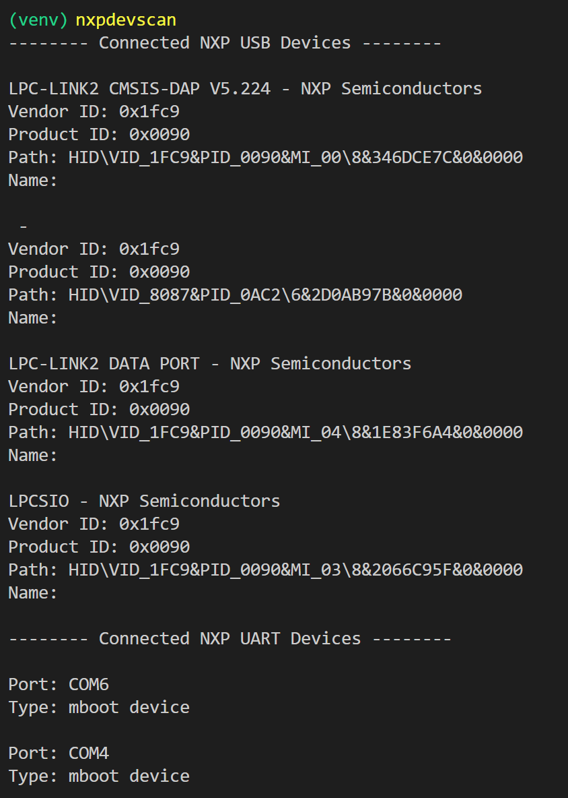

=======================
User Guide - nxpdevscan
=======================

This user’s guide describes how to use *nxpdevscan* application which detects NXP devices connected to the host PC over USB and UART connections.

The "help" guide of *nxpdevscan* lists all of the options supported by the *nxpdevscan* utility with a simple description of how to use them.

.. code:: bash

    nxpdevscan --help

------------------
nxpdevscan - Usage
------------------

To detect connected NXP devices use:

.. code:: bash

    nxpdevscan

    `nxpdevscan` lists NXP devices connected to host PC

.. click:: spsdk.apps.nxpdevscan:main
    :prog: nxpdevscan
    :nested: none

-----------------
nxpdevscan - UART
-----------------

*nxpdevscan* lists all devices connected using UART to the host PC in section *Connected NXP UART Devices*

:ref:`UART device identification in SPSDK`

----------------
nxpdevscan - USB
----------------

*nxpdevscan* lists all devices connected using USB to host PC in section *Connected NXP USB Devices*.

:ref:`USB device identification in SPSDK`
