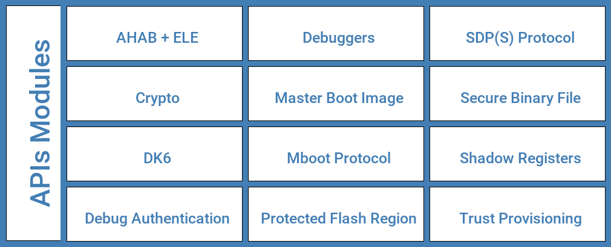

====
APIs
====

*SPSDK* offers SDK separated into modules, see bellow:

.. note:: See how to install *SPSDK* in :ref:`Installation Guide` chapter.

-----------------
APIs Connectivity
-----------------

SPSDK library communicates with NXP devices connected to the host PC. Details on how to configure the connectivity could be found in the following chapters:

.. toctree::
    :maxdepth: 1

    uart
    usb

----------
APIs Usage
----------

Please check *SPSDK* examples:

- :ref:`Jupyter notebooks`
- :ref:`Crypto examples`

Development guides for various SPSDK modules are bellow:

- :ref:`Crypto Module API`
- :ref:`Debug Authentication API`
- :ref:`Debuggers API`
- :ref:`Image Module API`
- :ref:`MBoot Module API`
- :ref:`Protected Flash Region API`
- :ref:`Shadow Registers API`
- :ref:`SBFile Module API`
- :ref:`SDP Module API`
- :ref:`Utils Module API`

Find user guides for various SPSDK modules bellow:

.. toctree::
    :maxdepth: 1

    image
    sbfile
    mboot
    sdp

