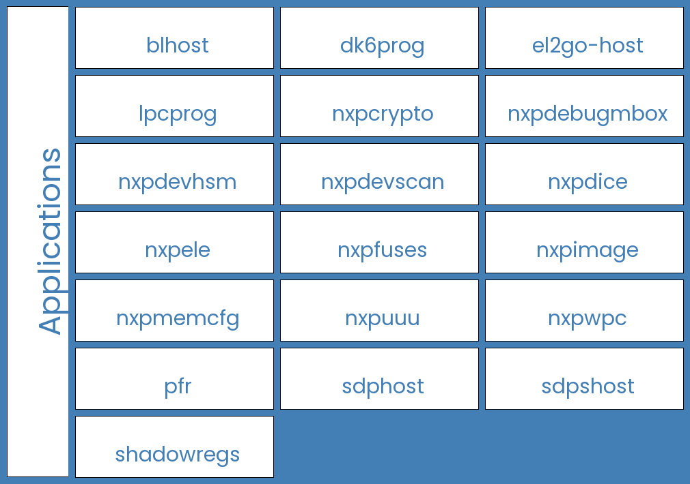

============
Applications
============

*SPSDK* includes several applications which could be called directly from the command line.

Command-line applications are available in ``PATH`` after activating a virtual environment with SPSDK installed in it.

.. note:: See how to install *SPSDK* in :ref:`Installation Guide` chapter.
    If you don't use virtual environments, the availability is not guaranteed (you'd need to add Python's Scripts folder to PATH first).

All applications could be accessed either using a special application called ``spsdk`` or directly by its name (e.g. ``blhost``, ``pfr``, ...).

.. code:: bash

    spsdk --help

------------------------
Application Philosophy
------------------------

The goal is to provide a simple way of interaction between the application and the user and avoid long and complex command lines with lots of options.
All configuration should be passed as configuration file.
Application should provide *get-template* command to generate a template of the configuration file for the selected family of devices.
This configuration file should be used as an input for the application and should be well described. The configuration file should be in YAML format.
Some applications are generating multiple templates, this is done using the *get-templates* command.

Most of the CLI application are used for generating some sort of binary files from configuration files, the command for generating the binary from configuration should be *export* with simple -c option for the configuration file.
Some applications also allow the user to parse the binary file and extract the configuration from it. This is done by the *parse* command with the -b option for the binary file.

.. code:: bash

    <application> get-template -o <output_config>
    <application> export -c <configuration_file>
    <application> parse -b <binary_file> -o <output_directory>

All applications should provide a help message with the list of available commands and options. The help message should be displayed when the application is called with the *--help* option.

Most of the applications require family option, specified as --family or -f option. This option is used to select the family of devices for which the application should be used. The family option is mandatory for most of the applications.
This allows the application to generate the correct configuration file for the selected family of devices and to validate the configuration file against the selected family of devices.

.. note:: Click strictly separates parameters between commands and subcommands. What this means is that options and arguments for a specific command have to be specified after the command name itself, but before any other command names.

------------------------
Application Connectivity
------------------------

Some applications communicate with NXP devices connected to the host PC. Details on how to configure the connectivity could be found in the following chapters:

.. toctree::
    :maxdepth: 1

    uart
    usb

--------------------
Application Overview
--------------------

:ref:`blhost`
=============

The *blhost* application is a utility for communication with MCU Bootloader on NXP devices.

It allows user to:

- apply configuration block at internal memory address to memory with ID
- program one word of OCOTP Field
- read one word of OCOTP Field
- erase region of the flash
- erase all flash/sections of flash according to memory id
- erase complete flash memory and recover flash security section
- fill memory with a pattern
- get/set bootloader-specific property
- write/read memory
- reset the device
- generate the Key Blob for a given DEK
- receive SB file
- load a boot image to the device
- key provisioning
- execute an application at the address
- write image to memory specified by ID
- invoke code at an address
- program aeskey
- disable flash security by using of backdoor key
- read resource of flash module
- program/read fuse
- list all memories
- perform reliable update
- invoke blhost commands defined in command file
- perform trust-provisioning commands

.. code:: bash

    blhost --help

:ref:`ifr`
================

The *ifr* application allows user to generate IFR0:

- generate user configuration
- parse binary and extract configuration
- generate binary data
- list supported devices

.. code:: bash

    ifr --help

:ref:`nxpcrypto`
=================

The *nxpcrypto* application allows user to:

- generate RSA/ECC key pairs (private and public) with various key's attributes
- verify key pairs
- convert key file format (PEM/DER/RAW)
- generate/verify x509 certificates
- generate/verify hash digests

.. code:: bash

    nxpcrypto --help

:ref:`nxpdebugmbox`
===================

The *nxpdebugmbox* application allows user to:

- perform the Debug Authentication
- start/exit Debug Mailbox
- enter ISP mode
- set Fault Analysis Mode
- erase flash
- test connection
- generate debug credential files based on YAML configuration file
- generate the template of Debug Credentials YAML configuration file

.. code:: bash

    nxpdebugmbox --help

:ref:`nxpdevhsm`
=================

The  *nxpdevhsm* application allows user to generate provisioned SB file.

.. code:: bash

    nxpdevhsm --help

:ref:`nxpdevscan`
=================

The *nxpdevscan* application allows users to list all connected USB and UART NXP devices.

.. code:: bash

    nxpdevscan --help

:ref:`nxpfuses`
================

The *nxpfuses* application allows users to:

- write single fuse into device
- write fuses from configuration into device
- generate the template of Fuses YAML configuration file
- generate blhost/nxpele script to burn fuses from configuration
- save the current state of fuses to config file
- print the current state of fuses from device

.. code:: bash

    nxpfuses --help

:ref:`nxpimage`
===============

The *nxpimage* application allows users to:

- generate/parse AHAB images
- generate/parse HAB images
- generate TrustZone images
- generate MasterBootImage images
- generate SecureBinary images
- generate custom binaries

.. code:: bash

    nxpimage --help

:ref:`nxpmemcfg`
================

The *nxpmemcfg* application allows users to:

- check database of known configuration option words for external memories
- parse existing configuration option words
- export option words from configuration
- generate BLHOST scripts to configure memory

.. code:: bash

    nxpmemcfg --help

:ref:`pfr`
==========

The *pfr* application is a utility for generating and parsing Protected Flash Region data (CMPA, CFPA).

It allows user to:

- generate user configuration
- parse binary and extract configuration
- generate binary data.
- generate HTML page with brief description of CMPA/CFPA configuration fields
- list supported devices

.. code:: bash

    pfr --help

:ref:`sdphost`
==============

The *sdphost* application is a utility for communication with ROM on i.MX targets using SDP protocol (i.MX RT1xxx).

It allows user to:

- get error code of the last operation
- jump to the entry point of the image with IVT at a specified address
- write a file at the address
- read one or more registers

.. code:: bash

    sdphost --help

:ref:`sdpshost`
===============

The *sdpshost* application is a utility for communication with ROM on i.MX targets using SDPS protocol (i.MX8/9).

It allows the user to write boot image data from the provided binary file.

.. warning:: This is an experimental utility. Use with caution!

.. code:: bash

    sdphost --help

:ref:`shadowregs`
=================

The *shadowregs* application is a utility for Shadow Registers controlling.

It allows user to:

- save the current state of shadow registers to the YAML file
- load new state of shadow registers from YAML file into the microcontroller
- print all shadow registers including their current values
- print the current value of one shadow register
- set a value of one shadow register defined by parameter
- reset the connected device
- print a list of supported devices

.. code:: bash

    shadowregs --help

:ref:`nxpuuu`
=================

The nxpuuu CLI application is designed for image deployment based on the libUUU (universal update utility). This guide provides instructions on how to use the various commands available in the application.

.. code:: bash

    nxpuuu --help

-------------------------------
Deleted/deprecated applications
-------------------------------

nxpcertgen
==========

.. note:: This tool was replaced by :ref:`nxpcrypto`

nxpkeygen
=========

.. note:: This tool was replaced by :ref:`nxpcrypto`

elftosb
=========

.. note:: This tool was replaced by :ref:`nxpimage`
