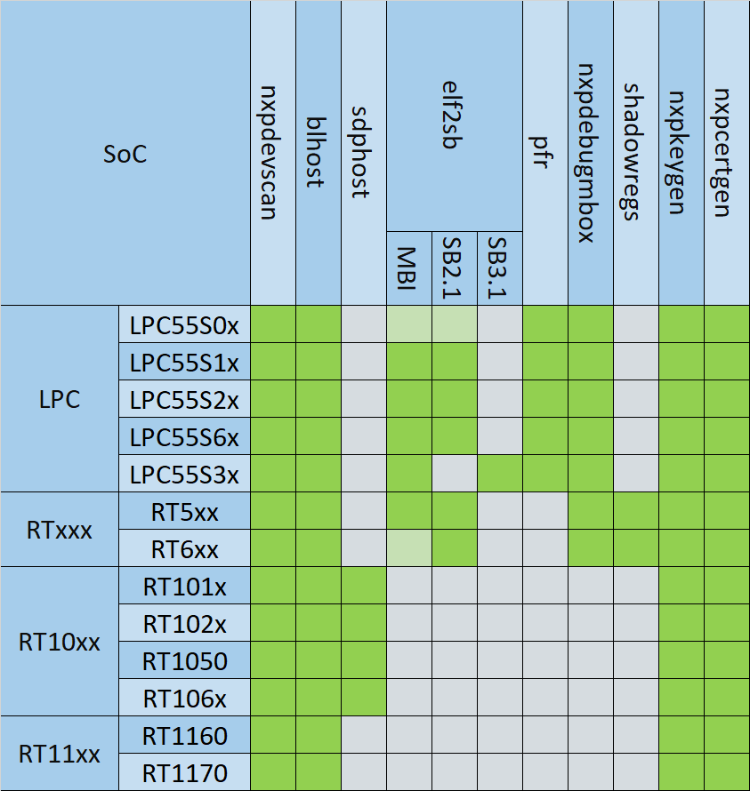

============
Applications
============

*SPSDK* includes several applications which could be called directly from the command line.

.. figure:: ../_static/images/spsdk-architecture-apps.png
    :scale: 50 %

Command-line applications are available in ``PATH`` after activating a virtual environment with SPSDK installed in it.

.. note:: See how to install *SPSDK* in :ref:`Installation Guide` chapter.
    If you don't use virtual environments, the availability is not guaranteed (you'd need to add Python's Scripts folder to PATH first).

All applications could be accessed either using a special application called ``spsdk`` or directly by its name (e.g. ``blhost``, ``pfr``, ...).

.. code:: bash

    spsdk --help

------------------------
Application Connectivity
------------------------

Some applications communicate with NXP devices connected to the host PC. Details on how to configure the connectivity could be found in the following chapters:

.. toctree::
    :maxdepth: 1

    uart
    usb

--------------------
Application Overview
--------------------

SPSDK applications are used for various functions and not all applications are valid for all NXP MCU device portfolios. The table mapping particular applications to a specific device is below.

:ref:`blhost`
=============

The *blhost* application is a utility for communication with MCU Bootloader on NXP devices.

It allows user to:

- apply configuration block at internal memory address to memory with ID
- program one word of OCOTP Field
- read one word of OCOTP Field
- erase region of the flash
- erase all flash/sections of flash according to memory id
- erase complete flash memory and recover flash security section
- fill memory with a pattern
- get/set bootloader-specific property
- write/read memory
- reset the device
- generate the Key Blob for a given DEK
- receive SB file
- load a boot image to the device
- key provisioning
- execute an application at the address
- write image to memory specified by ID
- invoke code at an address
- program aeskey
- disable flash security by using of backdoor key
- read resource of flash module
- program/read fuse
- list all memories
- perform reliable update
- invoke blhost commands defined in command file
- perform trust-provisioning commands

.. code:: bash

    blhost --help

:ref:`elftosb`
==============

The tool for generating TrustZone, MasterBootImage, and SecureBinary images.

- generate TrustZone
- generate MasterBootImage
- generate SecureBinary

.. note:: This tool is deprecated, use :ref:`nxpimage` instead

.. code:: bash

    elftosb --help

:ref:`nxpcertgen`
=================

The *nxpcertgen* application allows the user to:

- generate the self-signed x.509 certificates with properties given in the YAML configuration file.
- generate the template of Certificate generation YAML configuration file

The certificates are self-signed and support only BasicConstrains (ca, path_length).

.. code:: bash

    nxpcertgen --help

:ref:`nxpcrypto`
=================

The *nxpcrypto* application allows user to:

- generate RSA/ECC key pairs (private and public) with various key's attributes
- verify key pairs
- convert key file format (PEM/DER/RAW)
- generate/verify x509 certificates
- generate/verify hash digests

.. code:: bash

    nxpcrypto --help

:ref:`nxpdebugmbox`
===================

The *nxpdebugmbox* application allows user to:

- perform the Debug Authentication
- start/exit Debug Mailbox
- enter ISP mode
- set Fault Analysis Mode
- erase flash
- test connection
- generate debug credential files based on YAML configuration file
- generate the template of Debug Credentials YAML configuration file

.. code:: bash

    nxpdebugmbox --help

:ref:`nxpdevhsm`
=================

The  *nxpdevhsm* application allows user to generate provisioned SB file.

.. code:: bash

    nxpdevhsm --help

:ref:`nxpdevscan`
=================

The *nxpdevscan* application allows users to list all connected USB and UART NXP devices.

.. code:: bash

    nxpdevscan --help

:ref:`nxpimage`
===============

The *nxpimage* application allows users to:

- generate/parse AHAB images
- generate TrustZone images
- generate MasterBootImage images
- generate SecureBinary images
- generate custom binaries

.. code:: bash

    nxpimage --help

:ref:`nxpkeygen`
================

The *nxpkeygen* application allows user to:

- generate RSA/ECC key pairs (private and public) with various key's attributes

.. note:: This tool is deprecated, use :ref:`nxpcrypto` instead

.. code:: bash

    nxpkeygen --help

:ref:`pfr`
==========

The *pfr* application is a utility for generating and parsing Protected Flash Region data (CMPA, CFPA).

It allows user to:

- generate user configuration
- parse binary and extract configuration
- generate binary data.
- generate HTML page with brief description of CMPA/CFPA configuration fields
- list supported devices

.. code:: bash

    pfr --help

:ref:`sdphost`
==============

The *sdphost* application is a utility for communication with ROM on i.MX targets using SDP protocol (i.MX RT1xxx).

It allows user to:

- get error code of the last operation
- jump to the entry point of the image with IVT at a specified address
- write a file at the address
- read one or more registers

.. code:: bash

    sdphost --help

:ref:`sdpshost`
===============

The *sdpshost* application is a utility for communication with ROM on i.MX targets using SDPS protocol (i.MX8/9).

It allows the user to write boot image data from the provided binary file.

.. warning:: THIS IS AN EXPERIMENTAL UTILITY! USE WITH CAUTION !!!

.. code:: bash

    sdphost --help

:ref:`shadowregs`
=================

The *shadowregs* application is a utility for Shadow Registers controlling.

It allows user to:

- save the current state of shadow registers to the YAML file
- load new state of shadow registers from YAML file into the microcontroller
- print all shadow registers including their current values
- print the current value of one shadow register
- set a value of one shadow register defined by parameter
- reset the connected device
- print a list of supported devices

.. code:: bash

    shadowregs --help
