# SB 2.1 generation using BD file

This is a user guide describing how to generate a secure binary rev. 2.1 based on a configuration file (a so called BD file or command file) and additional inputs like certificates, keys, binary files etc.

## Supported Syntax

The syntax is written in EBNF (Extended Backus Naur Form), however, the `elftosb` application uses (namely SLY - python implementation of Lex/Yacc) only BNF. From this perspective the graphs visualize the EBNF form with the grammar and the conversion into BNF as well as remarks what is supported.

<html>

<head>
<meta http-equiv="Content-Type" content="text/html; charset=UTF-8">


<meta name="generator" content="Railroad Diagram Generator 1.63">

<style type="text/css">
::-moz-selection
{
color: #FFFCF0;
background: #0F0C00;
}
::selection
{
color: #FFFCF0;
background: #0F0C00;
}
.ebnf a, .grammar a
{
text-decoration: none;
}
.ebnf a:hover, .grammar a:hover
{
color: #050400;
text-decoration: underline;
}
.signature
{
color: #806600;
font-size: 11px;
text-align: right;
}
body
{
/* font: normal 12px Verdana, sans-serif; */
color: #0F0C00;
background: #FFFCF0;
}
/* a:link, a:visited
{
color: #0F0C00;
}
a:link.signature, a:visited.signature
{
color: #806600;
} */

a.button, #tabs li a
{
padding: 0.25em 0.5em;
border: 1px solid #806600;
background: #F1E8C6;
color: #806600;
text-decoration: none;
font-weight: bold;
}
a.button:hover, #tabs li a:hover
{
color: #050400;
background: #FFF6D1;
border-color: #050400;
}
#tabs
{
padding: 3px 10px;
margin-left: 0;
margin-top: 58px;
border-bottom: 1px solid #0F0C00;
}
#tabs li
{
list-style: none;
margin-left: 5px;
display: inline;
}
#tabs li a
{
border-bottom: 1px solid #0F0C00;
}
#tabs li a.active
{
color: #0F0C00;
background: #FFFCF0;
border-color: #0F0C00;
border-bottom: 1px solid #FFFCF0;
outline: none;
}
#divs div
{
display: none;
overflow:auto;
}
#divs div.active
{
display: block;
}
#text
{
border-color: #806600;
background: #FFFEFA;
color: #050400;
}
.small
{
vertical-align: top;
text-align: right;
font-size: 9px;
font-weight: normal;
line-height: 120%;
}
td.small
{
padding-top: 0px;
}
.hidden
{
visibility: hidden;
}
td:hover .hidden
{
visibility: visible;
}
div.download
{
display: none;
background: #fffcf0;
position: absolute;
right: 34px;
top: 94px;
padding: 10px;
border: 1px dotted #0f0c00;
}
#divs div.ebnf, .ebnf code
{
display: block;
padding: 10px;
background: #fff6d1;
width: 992px;
}
#divs div.grammar
{
display: block;
padding-left: 16px;
padding-top: 2px;
padding-bottom: 2px;
background: #fff6d1;
}
pre
{
margin: 0px;
}
.ebnf div
{
padding-left: 13ch;
text-indent: -13ch;
}
.ebnf code, .grammar code, textarea, pre
{
font:12px sfmono-regular,consolas,liberation mono,menlo,courier,monospace;
}
tr.option-line td:first-child
{
text-align: right
}
tr.option-text td
{
padding-bottom: 10px
}
table.palette
{
border-top: 1px solid #050400;
border-right: 1px solid #050400;
margin-bottom: 4px
}
td.palette
{
border-bottom: 1px solid #050400;
border-left: 1px solid #050400;
}
a.palette
{
padding: 2px 3px 2px 10px;
text-decoration: none;
}
.palette
{
-webkit-user-select: none;
-khtml-user-select: none;
-moz-user-select: none;
-o-user-select: none;
-ms-user-select: none;
}
</style>
</head>

<body>

<p style="font-size: 14px; font-weight:bold">
    <a name="command_file">command_file:</a>
</p>


<map name="command_file.map">
    <area shape="rect" coords="49,1,183,33" href="#pre_section_block" title="pre_section_block">
    <area shape="rect" coords="243,1,349,33" href="#section_block" title="section_block">
</map>

<p>
    <div class="ebnf">
        <code>
            <div>EBNF:
                <a href="#command_file" title="command_file">command_file</a>
            </div>
            <div>&nbsp;&nbsp;&nbsp;&nbsp;&nbsp;&nbsp;&nbsp;&nbsp;&nbsp;::=
                <a href="#pre_section_block" title="pre_section_block">pre_section_block</a>*
                <a href="#section_block" title="section_block">section_block</a>*
            </div>
        </code>
    </div>
    <div class="ebnf">
        <code>
            <div>BNF:
                <a href="#command_file" title="command_file">command_file</a>
            </div>
            <div>&nbsp;&nbsp;&nbsp;&nbsp;&nbsp;&nbsp;&nbsp;&nbsp;&nbsp;::=
                <a href="#pre_section_block" title="pre_section_block">pre_section_block</a>
                <a href="#section_block" title="section_block">section_block</a>
            </div>
        </code>
    </div>
</p>

<p>no references</p>

Comments:

The options block, constants block, sources block and keyblob block must be defined prior to the section block. There may be multiple blocks in any order, but all must precede the section blocks.

```
# options, sources, keyblob & constants must precede section block, but there may be
# multiple definitions in any order
options {

}

sources {

}

keyblob (0) {

}

constants {

}

options {

}

# Section blocks must be the very last blocks defined
section (1) {

}

section (2) {

}
```

<p style="font-size: 14px; font-weight:bold">
    <a name="pre_section_block">pre_section_block:</a>
</p>

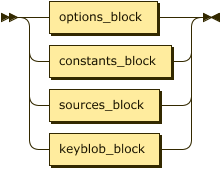
<map name="pre_section_block.map">
    <area shape="rect" coords="49,1,157,33" href="#options_block" title="options_block">
    <area shape="rect" coords="49,45,171,77" href="#constants_block" title="constants_block">
    <area shape="rect" coords="49,89,159,121" href="#sources_block" title="sources_block">
    <area shape="rect" coords="49,133,159,165" href="#keyblob_block" title="keyblob_block">
</map>

<p>
    <div class="ebnf">
        <code>
            <div>EBNF:
                <a href="#pre_section_block" title="pre_section_block">pre_section_block</a>
            </div>
            <div>&nbsp;&nbsp;&nbsp;&nbsp;&nbsp;&nbsp;&nbsp;&nbsp;&nbsp;::=
                <a href="#options_block" title="options_block">options_block</a>
            </div>
            <div>&nbsp;&nbsp;&nbsp;&nbsp;&nbsp;&nbsp;&nbsp;&nbsp;&nbsp;&nbsp;&nbsp;|
                <a href="#constants_block" title="constants_block">constants_block</a>
            </div>
            <div>&nbsp;&nbsp;&nbsp;&nbsp;&nbsp;&nbsp;&nbsp;&nbsp;&nbsp;&nbsp;&nbsp;|
                <a href="#sources_block" title="sources_block">sources_block</a>
            </div>
            <div>&nbsp;&nbsp;&nbsp;&nbsp;&nbsp;&nbsp;&nbsp;&nbsp;&nbsp;&nbsp;&nbsp;|
                <a href="#keyblob_block" title="keyblob_block">keyblob_block</a>
            </div>
        </code>
    </div>
    <div class="ebnf">
        <code>
            <div>BNF:
                <a href="#pre_section_block" title="pre_section_block">pre_section_block</a>
            </div>
            <div>&nbsp;&nbsp;&nbsp;&nbsp;&nbsp;&nbsp;&nbsp;&nbsp;&nbsp;::=
                <a href="#pre_section_block" title="pre_section_block">pre_section_block </a>
                <a href="#options_block" title="options_block">options_block</a>
            </div>
            <div>&nbsp;&nbsp;&nbsp;&nbsp;&nbsp;&nbsp;&nbsp;&nbsp;&nbsp;&nbsp;&nbsp;|
                <a href="#pre_section_block" title="pre_section_block">pre_section_block </a>
                <a href="#constants_block" title="constants_block">constants_block</a>
            </div>
            <div>&nbsp;&nbsp;&nbsp;&nbsp;&nbsp;&nbsp;&nbsp;&nbsp;&nbsp;&nbsp;&nbsp;|
                <a href="#pre_section_block" title="pre_section_block">pre_section_block </a>
                <a href="#sources_block" title="sources_block">sources_block</a>
            </div>
            <div>&nbsp;&nbsp;&nbsp;&nbsp;&nbsp;&nbsp;&nbsp;&nbsp;&nbsp;&nbsp;&nbsp;|
                <a href="#pre_section_block" title="pre_section_block">pre_section_block </a>
                <a href="#keyblob_block" title="keyblob_block">keyblob_block</a>
            </div>
            <div>&nbsp;&nbsp;&nbsp;&nbsp;&nbsp;&nbsp;&nbsp;&nbsp;&nbsp;&nbsp;&nbsp;|
                <a href="#empty" title="empty">empty</a>
            </div>
        </code>
    </div>
</p>

<p>referenced by:
    <ul>
        <li>
            <a href="#command_file" title="command_file">command_file</a>
        </li>
    </ul>
</p><br>

<p style="font-size: 14px; font-weight:bold">
    <a name="options_block">options_block:</a>
</p>

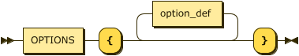

<map name="options_block.map">
    <area shape="rect" coords="29,35,105,67" href="#OPTIONS" title="OPTIONS">
    <area shape="rect" coords="193,1,281,33" href="#option_def" title="option_def">
</map>

<p>
    <div class="ebnf">
        <code>
            <div>
                EBNF: <a href="#options_block" title="options_block">options_block</a>
            </div>
            <div>
                &nbsp;&nbsp;&nbsp;&nbsp;&nbsp;&nbsp;&nbsp;&nbsp;&nbsp;::=
                <a href="#OPTIONS" title="OPTIONS">OPTIONS</a> '{'
                <a href="#option_def" title="option_def">option_def</a>* '}'
            </div>
        </code>
    </div>
    <div class="ebnf">
        <code>
            <div>
                BNF: <a href="#options_block" title="options_block">options_block</a>
            </div>
            <div>
                &nbsp;&nbsp;&nbsp;&nbsp;&nbsp;&nbsp;&nbsp;&nbsp;&nbsp;::=
                <a href="#OPTIONS" title="OPTIONS">OPTIONS</a> '{'
                <a href="#option_def" title="option_def">option_def</a> '}'
            </div>
        </code>
    </div>
</p>

<p>referenced by:
    <ul>
        <li>
            <a href="#pre_section_block" title="pre_section_block">pre_section_block</a>
        </li>
    </ul>
</p><br>

Comments:

```
Example:

options {
    opt1 = "some_string";
    opt2 = 1234;
    opt3 = 1 > 3;
    ...
}
```

<p style="font-size: 14px; font-weight:bold">
    <a name="option_def">option_def:</a>
</p>


<map name="option_def.map">
    <area shape="rect" coords="29,1,87,33" href="#IDENT" title="IDENT">
    <area shape="rect" coords="157,1,247,33" href="#const_expr" title="const_expr">
</map>

<p>
    <div class="ebnf">
        <code>
            <div>
                EBNF: <a href="#option_def" title="option_def">option_def</a>
            </div>
            <div>
                &nbsp;&nbsp;&nbsp;&nbsp;&nbsp;&nbsp;&nbsp;&nbsp;&nbsp;::=
                <a href="#IDENT" title="IDENT">IDENT</a> '='
                <a href="#const_expr" title="const_expr">const_expr</a> ';'
            </div>
        </code>
    </div>
    <div class="ebnf">
        <code>
            <div>
                BNF: <a href="#option_def" title="option_def">option_def</a>
            </div>
            <div>
                &nbsp;&nbsp;&nbsp;&nbsp;&nbsp;&nbsp;&nbsp;&nbsp;&nbsp;::=
                <a href="#option_def" title="option_def">option_def</a>
                <a href="#IDENT" title="IDENT">IDENT</a> '='
                <a href="#const_expr" title="const_expr">const_expr</a> ';'
            </div>
            <div>
                &nbsp;&nbsp;&nbsp;&nbsp;&nbsp;&nbsp;&nbsp;&nbsp;&nbsp;&nbsp;&nbsp;|
                <a href="#empty" title="empty">empty</a>
            </div>
        </code>
    </div>
</p>

<p>referenced by:
    <ul>
        <li>
            <a href="#constants_block" title="constants_block">constants_block</a>
        </li>
        <li>
            <a href="#options_block" title="options_block">options_block</a>
        </li>
    </ul>
</p><br>

<p style="font-size: 14px; font-weight:bold">
    <a name="constants_block">constants_block:</a>
</p>
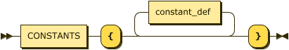
<map name="constants_block.map">
    <area shape="rect" coords="29,35,123,67" href="#CONSTANTS" title="CONSTANTS">
    <area shape="rect" coords="211,1,313,33" href="#constant_def" title="constant_def">
</map>

<p>
    <div class="ebnf">
        <code>
            <div>
                EBNF: <a href="#constants_block" title="constants_block">constants_block</a>
            </div>
            <div>&nbsp;&nbsp;&nbsp;&nbsp;&nbsp;&nbsp;&nbsp;&nbsp;&nbsp;::=
                <a href="#CONSTANTS" title="CONSTANTS">CONSTANTS</a> '{'
                <a href="#constant_def" title="constant_def">constant_def</a>* '}'
            </div>
        </code>
    </div>
    <div class="ebnf">
        <code>
            <div>
                BNF: <a href="#constants_block" title="constants_block">constants_block</a>
            </div>
            <div>&nbsp;&nbsp;&nbsp;&nbsp;&nbsp;&nbsp;&nbsp;&nbsp;&nbsp;::=
                <a href="#CONSTANTS" title="CONSTANTS">CONSTANTS</a> '{'
                <a href="#constant_def" title="constant_def">constant_def</a> '}'
            </div>
        </code>
    </div>
</p>

<p>referenced by:
    <ul>
        <li>
            <a href="#pre_section_block" title="pre_section_block">pre_section_block</a>
        </li>
    </ul>
</p><br>

Comments:
Only numbers can be assigned to identifiers in the constants block.

<p style="font-size: 14px; font-weight:bold">
    <a name="constant_def">constant_def:</a>
</p>


<map name="constant_def.map">
    <area shape="rect" coords="29,1,87,33" href="#IDENT" title="IDENT">
    <area shape="rect" coords="157,1,241,33" href="#bool_expr" title="bool_expr">
</map>

<p>
    <div class="ebnf">
        <code>
            <div>
                EBNF: <a href="#constant_def" title="constant_def">constant_def</a>
            </div>
            <div>&nbsp;&nbsp;&nbsp;&nbsp;&nbsp;&nbsp;&nbsp;&nbsp;&nbsp;::=
                <a href="#IDENT" title="IDENT">IDENT</a> '='
                <a href="#bool_expr" title="bool_expr">bool_expr</a> ';'
            </div>
        </code>
    </div>
    <div class="ebnf">
        <code>
            <div>
                BNF: <a href="#constant_def" title="constant_def">constant_def</a>
            </div>
            <div>&nbsp;&nbsp;&nbsp;&nbsp;&nbsp;&nbsp;&nbsp;&nbsp;&nbsp;::=
                <a href="#constant_def" title="constant_def">constant_def</a>
                <a href="#IDENT" title="IDENT">IDENT</a> '='
                <a href="#bool_expr" title="bool_expr">bool_expr</a> ';'
            </div>
            <div>&nbsp;&nbsp;&nbsp;&nbsp;&nbsp;&nbsp;&nbsp;&nbsp;&nbsp; |
                <a href="#empty" title="empty">empty</a>
            </div>
        </code>
    </div>
</p>

<p>referenced by:
    <ul>
        <li>
            <a href="#constants_block" title="constants_block">constants_block</a>
        </li>
    </ul>
</p><br>

<p style="font-size: 14px; font-weight:bold">
    <a name="sources_block">sources_block:</a>
</p>

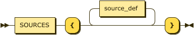
<map name="sources_block.map">
    <area shape="rect" coords="29,35,109,67" href="#SOURCES" title="SOURCES">
    <area shape="rect" coords="197,1,287,33" href="#source_def" title="source_def">
</map>

<p>
    <div class="ebnf">
        <code>
            <div>
                EBNF: <a href="#sources_block" title="sources_block">sources_block</a>
            </div>
            <div>
                &nbsp;&nbsp;&nbsp;&nbsp;&nbsp;&nbsp;&nbsp;&nbsp;&nbsp;::=
                <a href="#SOURCES" title="SOURCES">SOURCES</a> '{'
                <a href="#source_def" title="source_def">source_def</a>* '}'
            </div>
        </code>
    </div>
    <div class="ebnf">
        <code>
            <div>
                BNF: <a href="#sources_block" title="sources_block">sources_block</a>
            </div>
            <div>
                &nbsp;&nbsp;&nbsp;&nbsp;&nbsp;&nbsp;&nbsp;&nbsp;&nbsp;::=
                <a href="#SOURCES" title="SOURCES">SOURCES</a> '{'
                <a href="#source_def" title="source_def">source_def</a> '}'
            </div>
        </code>
    </div>
</p>

<p>referenced by:
    <ul>
        <li>
            <a href="#pre_section_block" title="pre_section_block">pre_section_block</a>
        </li>
    </ul>
</p><br>

<p style="font-size: 14px; font-weight:bold">
    <a name="source_def">source_def:</a>
</p>

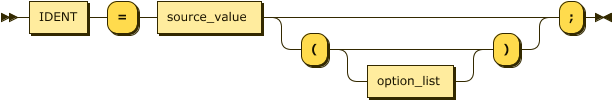
<map name="source_def.map">
    <area shape="rect" coords="29,1,87,33" href="#IDENT" title="IDENT">
    <area shape="rect" coords="157,1,261,33" href="#source_value" title="source_value">
    <area shape="rect" coords="367,65,453,97" href="#option_list" title="option_list">
</map>

<p>
    <div class="ebnf">
        <code>
            <div>
                EBNF: <a href="#source_def" title="source_def">source_def</a>
            </div>
            <div>
                &nbsp;&nbsp;&nbsp;&nbsp;&nbsp;&nbsp;&nbsp;&nbsp;&nbsp;::=
                <a href="#IDENT" title="IDENT">IDENT</a> '='
                <a href="#source_value" title="source_value">source_value</a>
                <del>( '(' <a href="#option_list" title="option_list">option_list</a>? ')' )?</del> ';'
            </div>
        </code>
    </div>
    <div class="ebnf">
        <code>
            <div>
                BNF: <a href="#source_def" title="source_def">source_def</a>
            </div>
            <div>
                &nbsp;&nbsp;&nbsp;&nbsp;&nbsp;&nbsp;&nbsp;&nbsp;&nbsp;::=
                <a href="#source_def" title="source_def">source_def</a>
                <a href="#IDENT" title="IDENT">IDENT</a> '='
                <a href="#source_value" title="source_value">source_value</a> ';'
            </div>
            <div>
                &nbsp;&nbsp;&nbsp;&nbsp;&nbsp;&nbsp;&nbsp;&nbsp;&nbsp;&nbsp;&nbsp;|
                <a href="#source_def" title="source_def">source_def</a>
                <a href="#IDENT" title="IDENT">IDENT</a> '='
                <a href="#source_value" title="source_value">source_value</a>
                <del>'(' <a href="#option_list" title="option_list">option_list</a> ')'</del> ';'
            </div>
            <div>
                &nbsp;&nbsp;&nbsp;&nbsp;&nbsp;&nbsp;&nbsp;&nbsp;&nbsp;&nbsp;&nbsp;|
                <a href="#empty" title="empty">empty</a>
            </div>
        </code>
    </div>
</p>

<p>referenced by:
    <ul>
        <li>
            <a href="#sources_block" title="sources_block">sources_block</a>
        </li>
    </ul>
</p><br>

Comments:

`option_list` in `source_def` is not supported and raises syntax error when used!
According to the grammar, identifiers defined in source block are referenced in the grammar
as `source_name`, however, the grammar can't be defined using this type of token, as there is
no rule to distinguish between an identifier token and a source name token. So the grammar uses
the `IDENT` token instead and documents this fact in description, that it's a `source_name` identifier.

<p style="font-size: 14px; font-weight:bold">
    <a name="source_value">source_value:</a>
</p>

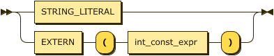
<map name="source_value.map">
    <area shape="rect" coords="49,1,173,33" href="#STRING_LITERAL" title="STRING_LITERAL">
    <area shape="rect" coords="49,45,117,77" href="#EXTERN" title="EXTERN">
    <area shape="rect" coords="183,45,297,77" href="#int_const_expr" title="int_const_expr">
</map>

<p>
    <div class="ebnf">
        <code>
            <div>
                EBNF: <a href="#source_value" title="source_value">source_value</a>
            </div>
            <div>
                &nbsp;&nbsp;&nbsp;&nbsp;&nbsp;&nbsp;&nbsp;&nbsp;&nbsp;::=
                <a href="#STRING_LITERAL" title="STRING_LITERAL">STRING_LITERAL</a>
            </div>
            <div>
                &nbsp;&nbsp;&nbsp;&nbsp;&nbsp;&nbsp;&nbsp;&nbsp;&nbsp;&nbsp;&nbsp;|
                <a href="#EXTERN" title="EXTERN">EXTERN</a> '('
                <a href="#int_const_expr" title="int_const_expr">int_const_expr</a> ')'
            </div>
        </code>
    </div>
    <div class="ebnf">
        <code>
            <div>
                BNF: <a href="#source_value" title="source_value">source_value</a>
            </div>
            <div>
                &nbsp;&nbsp;&nbsp;&nbsp;&nbsp;&nbsp;&nbsp;&nbsp;&nbsp;::=
                <a href="#STRING_LITERAL" title="STRING_LITERAL">STRING_LITERAL</a>
            </div>
            <div>
                &nbsp;&nbsp;&nbsp;&nbsp;&nbsp;&nbsp;&nbsp;&nbsp;&nbsp;&nbsp;&nbsp;|
                <a href="#EXTERN" title="EXTERN">EXTERN</a> '('
                <a href="#int_const_expr" title="int_const_expr">int_const_expr</a> ')'
            </div>
        </code>
    </div>
</p>

<p>referenced by:
    <ul>
        <li>
            <a href="#source_def" title="source_def">source_def</a>
        </li>
    </ul>
</p><br>

Comments:

The EXTERN keyword references source files defined on the command line as the very last arguments indexed from 0. In the example below, extern(1) would reference the "./file2" file provided on command line.

Command file example:
```
sources {
    my_binary_file = extern(1); # my_binary_file = file2.bin
}
```

Command line usage:
```
elf2sb -c.. -o.. "some/path/to/file1.bin" "./file2.bin"
```

<p style="font-size: 14px; font-weight:bold">
    <a name="option_list">option_list:</a>
</p>

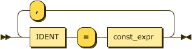
<map name="option_list.map">
    <area shape="rect" coords="49,45,107,77" href="#IDENT" title="IDENT">
    <area shape="rect" coords="177,45,267,77" href="#const_expr" title="const_expr">
</map>

<p>
    <div class="ebnf">
        <code>
            <div>
                EBNF: <a href="#option_list" title="option_list">option_list</a>
            </div>
            <div>
                &nbsp;&nbsp;&nbsp;&nbsp;&nbsp;&nbsp;&nbsp;&nbsp;&nbsp;::=
                <a href="#IDENT" title="IDENT">IDENT</a> '='
                <a href="#const_expr" title="const_expr">const_expr</a> ( ','
                <a href="#IDENT" title="IDENT">IDENT</a> '='
                <a href="#const_expr" title="const_expr">const_expr</a> )*
            </div>
        </code>
    </div>
    <div class="ebnf">
        <code>
            <div>
                BNF: <a href="#option_list" title="option_list">option_list</a>
            </div>
            <div>
                &nbsp;&nbsp;&nbsp;&nbsp;&nbsp;&nbsp;&nbsp;&nbsp;&nbsp;::=
                <a href="#IDENT" title="IDENT">IDENT</a> '='
                <a href="#const_expr" title="const_expr">const_expr</a> ','
                <a href="#option_list" title="option_list">option_list</a>
            </div>
            <div>
                &nbsp;&nbsp;&nbsp;&nbsp;&nbsp;&nbsp;&nbsp;&nbsp;&nbsp;|
                <a href="#IDENT" title="IDENT">IDENT</a> '='
                <a href="#const_expr" title="const_expr">const_expr</a>
            </div>
        </code>
    </div>
</p>

<p>referenced by:
    <ul>
        <li>
            <a href="#keyblob_contents" title="keyblob_contents">keyblob_contents</a>
        </li>
        <li>
            <a href="#section_options" title="section_options">section_options</a>
        </li>
        <li>
            <a href="#source_def" title="source_def">source_def</a>
        </li>
    </ul>
</p><br>

<p style="font-size: 14px; font-weight:bold">
    <a name="keyblob_block">keyblob_block:</a>
</p>

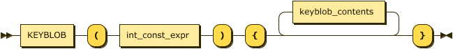
<map name="keyblob_block.map">
    <area shape="rect" coords="29,35,105,67" href="#KEYBLOB" title="KEYBLOB">
    <area shape="rect" coords="171,35,285,67" href="#int_const_expr" title="int_const_expr">
    <area shape="rect" coords="419,1,551,33" href="#keyblob_contents" title="keyblob_contents">
</map>

<p>
    <div class="ebnf">
        <code>
            <div>
                EBNF: <a href="#keyblob_block" title="keyblob_block">keyblob_block</a>
            </div>
            <div>
                &nbsp;&nbsp;&nbsp;&nbsp;&nbsp;&nbsp;&nbsp;&nbsp;&nbsp;::=
                <a href="#KEYBLOB" title="KEYBLOB">KEYBLOB</a> '('
                <a href="#int_const_expr" title="int_const_expr">int_const_expr</a> ')' '{'
                <a href="#keyblob_contents" title="keyblob_contents">keyblob_contents</a>* '}'
            </div>
        </code>
    </div>
    <div class="ebnf">
        <code>
            <div>
                BNF: <a href="#keyblob_block" title="keyblob_block">keyblob_block</a>
            </div>
            <div>
                &nbsp;&nbsp;&nbsp;&nbsp;&nbsp;&nbsp;&nbsp;&nbsp;&nbsp;::=
                <a href="#KEYBLOB" title="KEYBLOB">KEYBLOB</a> '('
                <a href="#int_const_expr" title="int_const_expr">int_const_expr</a> ')' '{'
                <a href="#keyblob_contents" title="keyblob_contents">keyblob_contents</a> '}'
            </div>
        </code>
    </div>
</p>

<p>referenced by:
    <ul>
        <li>
            <a href="#pre_section_block" title="pre_section_block">pre_section_block</a>
        </li>
    </ul>
</p><br>

Comments:

The keyblob block grammar has been modified and it supports only single keyblob_contents
definition, which must not be empty!

Example
```
keyblob (1) {
    (
        start = 0x0800000,
        end = 0x08001000,
        key = "12345678901234567890123456789012",
        counter = "1122334455667788",
        byteSwap = False
    )
    # No further definitions allowed, if present, syntax error will be raised!
}
```

<p style="font-size: 14px; font-weight:bold">
    <a name="keyblob_contents">keyblob_contents:</a>
</p>


<map name="keyblob_contents.map">
    <area shape="rect" coords="95,1,181,33" href="#option_list" title="option_list">
</map>

<p>
    <div class="ebnf">
        <code>
            <div>
                EBNF: <a href="#keyblob_contents" title="keyblob_contents">keyblob_contents</a>
            </div>
            <div>
                &nbsp;&nbsp;&nbsp;&nbsp;&nbsp;&nbsp;&nbsp;&nbsp;&nbsp;::= '('
                <a href="#option_list" title="option_list">option_list</a>* ')'
            </div>
        </code>
    </div>
    <div class="ebnf">
        <code>
            <div>
                BNF: <a href="#keyblob_contents" title="keyblob_contents">keyblob_contents</a>
            </div>
            <div>
                &nbsp;&nbsp;&nbsp;&nbsp;&nbsp;&nbsp;&nbsp;&nbsp;&nbsp;::=
                <a href="#keyblob_contents" title="keyblob_contents">keyblob_contents</a> '('
                <a href="#option_list" title="option_list">option_list</a> ')'
            </div>
            <div>
                &nbsp;&nbsp;&nbsp;&nbsp;&nbsp;&nbsp;&nbsp;&nbsp;&nbsp;|
                <a href="#empty" title="empty">empty</a>
            </div>
        </code>
    </div>
</p>

<p>referenced by:
    <ul>
        <li>
            <a href="#keyblob_block" title="keyblob_block">keyblob_block</a>
        </li>
    </ul>
</p><br>

Comments:

The keyblob contents must define:
```
start [integer] - start address 'maintained' by this keyblob
end [integer] - end address 'maintained' by this keyblob
key [string] - key used to encode data stored into address range defined by this keyblob
counter [string] - TODO
byteSwap [boolean, optional] - TODO
```

Anything else defined under keyblob is ignored. If definition of keywords listed above, except 'byteSwap' is missing, a syntax error will be raised.

<p style="font-size: 14px; font-weight:bold">
    <a name="section_block">section_block:</a>
</p>

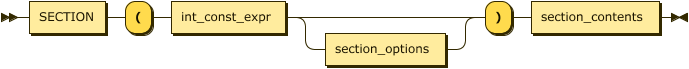
<map name="section_block.map">
    <area shape="rect" coords="29,1,105,33" href="#SECTION" title="SECTION">
    <area shape="rect" coords="171,1,285,33" href="#int_const_expr" title="int_const_expr">
    <area shape="rect" coords="325,33,445,65" href="#section_options" title="section_options">
    <area shape="rect" coords="531,1,659,33" href="#section_contents" title="section_contents">
</map>

<p>
    <div class="ebnf">
        <code>
            <div>
                EBNF: <a href="#section_block" title="section_block">section_block</a>
            </div>
            <div>
                &nbsp;&nbsp;&nbsp;&nbsp;&nbsp;&nbsp;&nbsp;&nbsp;&nbsp;::=
                <a href="#SECTION" title="SECTION">SECTION</a> '('
                <a href="#int_const_expr" title="int_const_expr">int_const_expr</a>
                <del><a href="#section_options" title="section_options">section_options</a>?</del> ')'
                <a href="#section_contents" title="section_contents">section_contents</a>
            </div>
        </code>
    </div>
    <div class="ebnf">
        <code>
            <div>
                BNF: <a href="#section_block" title="section_block">section_block</a>
            </div>
            <div>
                &nbsp;&nbsp;&nbsp;&nbsp;&nbsp;&nbsp;&nbsp;&nbsp;&nbsp;::=
                <a href="#section_blockw" title="section_block">section_block</a>
                <a href="#SECTION" title="SECTION">SECTION</a> '('
                <a href="#int_const_expr" title="int_const_expr">int_const_expr</a>
                <del><a href="#section_options" title="section_options">section_options</a></del> ')'
                <a href="#section_contents" title="section_contents">section_contents</a>
            </div>
            <div>
                &nbsp;&nbsp;&nbsp;&nbsp;&nbsp;&nbsp;&nbsp;&nbsp;&nbsp;|
                <a href="#empty" title="empty">empty</a>
            </div>
        </code>
    </div>
</p>

<p>referenced by:
    <ul>
        <li>
            <a href="#command_file" title="command_file">command_file</a>
        </li>
    </ul>
</p><br>

Comments:

`section_options` is not supported and raises syntax error when used!

<p style="font-size: 14px; font-weight:bold">
    <a name="section_options">section_options:</a>
</p>

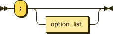
<map name="section_options.map">
    <area shape="rect" coords="93,33,179,65" href="#option_list" title="option_list">
</map>

<p>
    <div class="ebnf">
        <code>
            <div>
                EBNF: <a href="#section_options" title="section_options">section_options</a>
            </div>
            <div>
                &nbsp;&nbsp;&nbsp;&nbsp;&nbsp;&nbsp;&nbsp;&nbsp;&nbsp;::= ';'
                <a href="#option_list" title="option_list">option_list</a>?
            </div>
        </code>
    </div>
    <div class="ebnf">
        <code>
            <div>
                BNF: <a href="#section_options" title="section_options">section_options</a>
            </div>
            <div>
                &nbsp;&nbsp;&nbsp;&nbsp;&nbsp;&nbsp;&nbsp;&nbsp;&nbsp;::= ';'
                <a href="#option_list" title="option_list">option_list</a>
            </div>
            <div>
                &nbsp;&nbsp;&nbsp;&nbsp;&nbsp;&nbsp;&nbsp;&nbsp;&nbsp;|
                <a href="#';'" title="';'">';'</a>
            </div>
            <div>
                &nbsp;&nbsp;&nbsp;&nbsp;&nbsp;&nbsp;&nbsp;&nbsp;&nbsp;|
                <a href="#empty" title="empty">empty</a>
            </div>
        </code>
    </div>
</p>

<p>referenced by:
    <ul>
        <li>
            <a href="#section_block" title="section_block">section_block</a>
        </li>
    </ul>
</p><br>

<p style="font-size: 14px; font-weight:bold">
    <a name="section_contents">section_contents:</a>
</p>

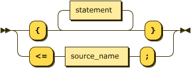
<map name="section_contents.map">
    <area shape="rect" coords="117,1,203,33" href="#statement" title="statement">
    <area shape="rect" coords="109,79,215,111" href="#source_name" title="source_name">
</map>

<p>
    <div class="ebnf">
        <code>
            <div>
                EBNF: <a href="#section_contents" title="section_contents">section_contents</a>
            </div>
            <div>
                &nbsp;&nbsp;&nbsp;&nbsp;&nbsp;&nbsp;&nbsp;&nbsp;&nbsp;::= '{'
                <a href="#statement" title="statement">statement</a>* '}'
            </div>
            <div>
                &nbsp;&nbsp;&nbsp;&nbsp;&nbsp;&nbsp;&nbsp;&nbsp;&nbsp;&nbsp;&nbsp;|
                <del>'&lt;=' <a href="#IDENT" title="IDENT">IDENT</a> ';'</del>
            </div>
        </code>
    </div>
    <div class="ebnf">
        <code>
            <div>
                BNF: <a href="#section_contents" title="section_contents">section_contents</a>
            </div>
            <div>
                &nbsp;&nbsp;&nbsp;&nbsp;&nbsp;&nbsp;&nbsp;&nbsp;&nbsp;::= '{'
                <a href="#statement" title="statement">statement</a> '}'
            </div>
            <div>
                &nbsp;&nbsp;&nbsp;&nbsp;&nbsp;&nbsp;&nbsp;&nbsp;&nbsp;&nbsp;&nbsp;|
                <del>'&lt;=' <a href="#IDENT" title="IDENT">IDENT</a> ';'</del>
            </div>
        </code>
    </div>
</p>

<p>referenced by:
    <ul>
        <li>
            <a href="#section_block" title="section_block">section_block</a>
        </li>
    </ul>
</p><br>

Comments:

`<= IDENT` is not supported and raises syntax error when used!

The IDENT in `<= IDENT` must be an identifier defined in the sources block, otherwise an error is raised.

<p style="font-size: 14px; font-weight:bold">
    <a name="statement">statement:</a>
</p>

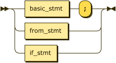
<map name="statement.map">
    <area shape="rect" coords="49,1,137,33" href="#basic_stmt" title="basic_stmt">
    <area shape="rect" coords="49,45,135,77" href="#from_stmt" title="from_stmt">
    <area shape="rect" coords="49,89,113,121" href="#if_stmt" title="if_stmt">
</map>

<p>
    <div class="ebnf">
        <code>
            <div>
                EBNF: <a href="#statement" title="statement">statement</a>
            </div>
            <div>
                &nbsp;&nbsp;&nbsp;&nbsp;&nbsp;&nbsp;&nbsp;&nbsp;&nbsp;::=
                <a href="#basic_stmt" title="basic_stmt">basic_stmt</a> ';'
            </div>
            <div>
                &nbsp;&nbsp;&nbsp;&nbsp;&nbsp;&nbsp;&nbsp;&nbsp;&nbsp;&nbsp;&nbsp;|
                <a href="#from_stmt" title="from_stmt">from_stmt</a>
            </div>
            <div>
                &nbsp;&nbsp;&nbsp;&nbsp;&nbsp;&nbsp;&nbsp;&nbsp;&nbsp;&nbsp;&nbsp;|
                <a href="#if_stmt" title="if_stmt">if_stmt</a>
            </div>
        </code>
    </div>
    <div class="ebnf">
        <code>
            <div>
                BNF: <a href="#statement" title="statement">statement</a>
            </div>
            <div>
                &nbsp;&nbsp;&nbsp;&nbsp;&nbsp;&nbsp;&nbsp;&nbsp;&nbsp;::=
                <a href="#statement" title="statement">statement</a>
                <a href="#basic_stmt" title="basic_stmt">basic_stmt</a> ';'
            </div>
            <div>
                &nbsp;&nbsp;&nbsp;&nbsp;&nbsp;&nbsp;&nbsp;&nbsp;&nbsp;&nbsp;&nbsp;|
                <a href="#statement" title="statement">statement</a>
                <a href="#from_stmt" title="from_stmt">from_stmt</a>
            </div>
            <div>
                &nbsp;&nbsp;&nbsp;&nbsp;&nbsp;&nbsp;&nbsp;&nbsp;&nbsp;&nbsp;&nbsp;|
                <a href="#statement" title="statement">statement</a>
                <a href="#if_stmt" title="if_stmt">if_stmt</a>
            </div>
            <div>
                &nbsp;&nbsp;&nbsp;&nbsp;&nbsp;&nbsp;&nbsp;&nbsp;&nbsp;&nbsp;&nbsp;|
                <a href="#empty" title="empty">empty</a>
            </div>
        </code>
    </div>
</p>

<p>referenced by:

<ul>
    <li>
        <a href="#else_stmt" title="else_stmt">else_stmt</a>
    </li>
    <li>
        <a href="#encrypt_stmt" title="encrypt_stmt">encrypt_stmt</a>
    </li>
    <li>
        <a href="#if_stmt" title="if_stmt">if_stmt</a>
    </li>
    <li>
        <a href="#section_contents" title="section_contents">section_contents</a>
    </li>
</ul>

</p><br>

<p style="font-size: 14px; font-weight:bold">
    <a name="basic_stmt">basic_stmt:</a>
</p>

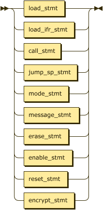
<map name="basic_stmt.map">
    <area shape="rect" coords="49,1,133,33" href="#load_stmt" title="load_stmt">
    <area shape="rect" coords="49,45,153,77" href="#load_ifr_stmt" title="load_ifr_stmt">
    <area shape="rect" coords="49,89,125,121" href="#call_stmt" title="call_stmt">
    <area shape="rect" coords="49,133,159,165" href="#jump_sp_stmt" title="jump_sp_stmt">
    <area shape="rect" coords="49,177,141,209" href="#mode_stmt" title="mode_stmt">
    <area shape="rect" coords="49,221,163,253" href="#message_stmt" title="message_stmt">
    <area shape="rect" coords="49,265,141,297" href="#erase_stmt" title="erase_stmt">
    <area shape="rect" coords="49,309,149,341" href="#enable_stmt" title="enable_stmt">
    <area shape="rect" coords="49,353,139,385" href="#reset_stmt" title="reset_stmt">
    <area shape="rect" coords="49,397,153,429" href="#encrypt_stmt" title="encrypt_stmt">
</map>

<p>
    <div class="ebnf">
        <code>
            <div>
                EBNF: <a href="#basic_stmt" title="basic_stmt">basic_stmt</a>
            </div>
            <div>
                &nbsp;&nbsp;&nbsp;&nbsp;&nbsp;&nbsp;&nbsp;&nbsp;&nbsp;::=
                <a href="#load_stmt" title="load_stmt">load_stmt</a>
            </div>
            <div>
                &nbsp;&nbsp;&nbsp;&nbsp;&nbsp;&nbsp;&nbsp;&nbsp;&nbsp;&nbsp;&nbsp;|
                <a href="#load_ifr_stmt" title="load_ifr_stmt">load_ifr_stmt</a>
            </div>
            <div>
                &nbsp;&nbsp;&nbsp;&nbsp;&nbsp;&nbsp;&nbsp;&nbsp;&nbsp;&nbsp;&nbsp;|
                <a href="#call_stmt" title="call_stmt">call_stmt</a>
            </div>
            <div>
                &nbsp;&nbsp;&nbsp;&nbsp;&nbsp;&nbsp;&nbsp;&nbsp;&nbsp;&nbsp;&nbsp;|
                <a href="#jump_sp_stmt" title="jump_sp_stmt">jump_sp_stmt</a>
            </div>
            <div>
                &nbsp;&nbsp;&nbsp;&nbsp;&nbsp;&nbsp;&nbsp;&nbsp;&nbsp;&nbsp;&nbsp;|
                <a href="#mode_stmt" title="mode_stmt">mode_stmt</a>
            </div>
            <div>
                &nbsp;&nbsp;&nbsp;&nbsp;&nbsp;&nbsp;&nbsp;&nbsp;&nbsp;&nbsp;&nbsp;|
                <a href="#message_stmt" title="message_stmt">message_stmt</a>
            </div>
            <div>
                &nbsp;&nbsp;&nbsp;&nbsp;&nbsp;&nbsp;&nbsp;&nbsp;&nbsp;&nbsp;&nbsp;|
                <a href="#erase_stmt" title="erase_stmt">erase_stmt</a>
            </div>
            <div>
                &nbsp;&nbsp;&nbsp;&nbsp;&nbsp;&nbsp;&nbsp;&nbsp;&nbsp;&nbsp;&nbsp;|
                <a href="#enable_stmt" title="enable_stmt">enable_stmt</a>
            </div>
            <div>
                &nbsp;&nbsp;&nbsp;&nbsp;&nbsp;&nbsp;&nbsp;&nbsp;&nbsp;&nbsp;&nbsp;|
                <a href="#reset_stmt" title="reset_stmt">reset_stmt</a>
            </div>
            <div>
                &nbsp;&nbsp;&nbsp;&nbsp;&nbsp;&nbsp;&nbsp;&nbsp;&nbsp;&nbsp;&nbsp;|
                <a href="#encrypt_stmt" title="encrypt_stmt">encrypt_stmt</a>
            </div>
        </code>
    </div>
    <div class="ebnf">
        <code>
            <div>
                BNF: <a href="#basic_stmt" title="basic_stmt">basic_stmt</a>
            </div>
            <div>
                &nbsp;&nbsp;&nbsp;&nbsp;&nbsp;&nbsp;&nbsp;&nbsp;&nbsp;::=
                <a href="#load_stmt" title="load_stmt">load_stmt</a>
            </div>
            <div>
                &nbsp;&nbsp;&nbsp;&nbsp;&nbsp;&nbsp;&nbsp;&nbsp;&nbsp;&nbsp;&nbsp;|
                <a href="#load_ifr_stmt" title="load_ifr_stmt">load_ifr_stmt</a>
            </div>
            <div>
                &nbsp;&nbsp;&nbsp;&nbsp;&nbsp;&nbsp;&nbsp;&nbsp;&nbsp;&nbsp;&nbsp;|
                <a href="#call_stmt" title="call_stmt">call_stmt</a>
            </div>
            <div>
                &nbsp;&nbsp;&nbsp;&nbsp;&nbsp;&nbsp;&nbsp;&nbsp;&nbsp;&nbsp;&nbsp;|
                <a href="#jump_sp_stmt" title="jump_sp_stmt">jump_sp_stmt</a>
            </div>
            <div>
                &nbsp;&nbsp;&nbsp;&nbsp;&nbsp;&nbsp;&nbsp;&nbsp;&nbsp;&nbsp;&nbsp;|
                <a href="#mode_stmt" title="mode_stmt">mode_stmt</a>
            </div>
            <div>
                &nbsp;&nbsp;&nbsp;&nbsp;&nbsp;&nbsp;&nbsp;&nbsp;&nbsp;&nbsp;&nbsp;|
                <a href="#message_stmt" title="message_stmt">message_stmt</a>
            </div>
            <div>
                &nbsp;&nbsp;&nbsp;&nbsp;&nbsp;&nbsp;&nbsp;&nbsp;&nbsp;&nbsp;&nbsp;|
                <a href="#erase_stmt" title="erase_stmt">erase_stmt</a>
            </div>
            <div>
                &nbsp;&nbsp;&nbsp;&nbsp;&nbsp;&nbsp;&nbsp;&nbsp;&nbsp;&nbsp;&nbsp;|
                <a href="#enable_stmt" title="enable_stmt">enable_stmt</a>
            </div>
            <div>
                &nbsp;&nbsp;&nbsp;&nbsp;&nbsp;&nbsp;&nbsp;&nbsp;&nbsp;&nbsp;&nbsp;|
                <a href="#reset_stmt" title="reset_stmt">reset_stmt</a>
            </div>
            <div>
                &nbsp;&nbsp;&nbsp;&nbsp;&nbsp;&nbsp;&nbsp;&nbsp;&nbsp;&nbsp;&nbsp;|
                <a href="#encrypt_stmt" title="encrypt_stmt">encrypt_stmt</a>
            </div>
        </code>
    </div>
</p>

<p>referenced by:
    <ul>
        <li>
            <a href="#in_from_stmt" title="in_from_stmt">in_from_stmt</a>
        </li>
        <li>
            <a href="#statement" title="statement">statement</a>
        </li>
    </ul>
</p><br>

<p style="font-size: 14px; font-weight:bold">
    <a name="load_stmt">load_stmt:</a>
</p>

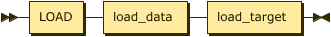
<map name="load_stmt.map">
    <area shape="rect" coords="29,1,83,33" href="#LOAD" title="LOAD">
    <area shape="rect" coords="103,1,187,33" href="#load_data" title="load_data">
    <area shape="rect" coords="207,1,301,33" href="#load_target" title="load_target">
</map>

<p>
    <div class="ebnf">
        <code>
            <div>
                EBNF: <a href="#load_stmt" title="load_stmt">load_stmt</a>
            </div>
            <div>
                &nbsp;&nbsp;&nbsp;&nbsp;&nbsp;&nbsp;&nbsp;&nbsp;&nbsp;::=
                <a href="#LOAD" title="LOAD">LOAD</a>
                <a href="#load_data" title="load_data">load_data</a>
                <a href="#load_target" title="load_target">load_target</a>
            </div>
        </code>
    </div>
    <div class="ebnf">
        <code>
            <div>
                BNF: <a href="#load_stmt" title="load_stmt">load_stmt</a>
            </div>
            <div>
                &nbsp;&nbsp;&nbsp;&nbsp;&nbsp;&nbsp;&nbsp;&nbsp;&nbsp;::=
                <a href="#LOAD" title="LOAD">LOAD</a>
                <a href="#load_data" title="load_data">load_data</a>
                <a href="#load_target" title="load_target">load_target</a>
            </div>
        </code>
    </div>
</p>

<p>referenced by:
    <ul>
        <li>
            <a href="#basic_stmt" title="basic_stmt">basic_stmt</a>
        </li>
    </ul>
</p><br>

<p style="font-size: 14px; font-weight:bold">
    <a name="load_data">load_data:</a>
</p>

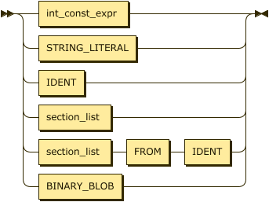
<map name="load_data.map">
    <area shape="rect" coords="49,1,163,33" href="#int_const_expr" title="int_const_expr">
    <area shape="rect" coords="49,45,173,77" href="#STRING_LITERAL" title="STRING_LITERAL">
    <area shape="rect" coords="49,89,107,121" href="#IDENT" title="IDENT">
    <area shape="rect" coords="49,133,141,165" href="#section_list" title="section_list">
    <area shape="rect" coords="181,165,235,197" href="#FROM" title="FROM">
    <area shape="rect" coords="255,165,313,197" href="#IDENT" title="IDENT">
    <area shape="rect" coords="49,209,155,241" href="#BINARY_BLOB" title="BINARY_BLOB">
</map>

<p>
    <div class="ebnf">
        <code>
            <div>
                EBNF: <a href="#load_data" title="load_data">load_data</a>
            </div>
            <div>
                &nbsp;&nbsp;&nbsp;&nbsp;&nbsp;&nbsp;&nbsp;&nbsp;&nbsp;::=
                <a href="#int_const_expr" title="int_const_expr">int_const_expr</a>
            </div>
            <div>
                &nbsp;&nbsp;&nbsp;&nbsp;&nbsp;&nbsp;&nbsp;&nbsp;&nbsp;&nbsp;&nbsp;|
                <a href="#STRING_LITERAL" title="STRING_LITERAL">STRING_LITERAL</a>
            </div>
            <div>
                &nbsp;&nbsp;&nbsp;&nbsp;&nbsp;&nbsp;&nbsp;&nbsp;&nbsp;&nbsp;&nbsp;|
                <a href="#IDENT" title="IDENT">IDENT</a>
            </div>
            <div>
                &nbsp;&nbsp;&nbsp;&nbsp;&nbsp;&nbsp;&nbsp;&nbsp;&nbsp;&nbsp;&nbsp;|
                <a href="#section_list" title="section_list">section_list</a> (
                <a href="#FROM" title="FROM">FROM</a>
                <a href="#IDENT" title="IDENT">IDENT</a> )?
            </div>
            <div>
                &nbsp;&nbsp;&nbsp;&nbsp;&nbsp;&nbsp;&nbsp;&nbsp;&nbsp;&nbsp;&nbsp;|
                <a href="#BINARY_BLOB" title="BINARY_BLOB">BINARY_BLOB</a>
            </div>
        </code>
    </div>
    <div class="ebnf">
        <code>
            <div>
                BNF: <a href="#load_data" title="load_data">load_data</a>
            </div>
            <div>
                &nbsp;&nbsp;&nbsp;&nbsp;&nbsp;&nbsp;&nbsp;&nbsp;&nbsp;::=
                <a href="#int_const_expr" title="int_const_expr">int_const_expr</a>
            </div>
            <div>
                &nbsp;&nbsp;&nbsp;&nbsp;&nbsp;&nbsp;&nbsp;&nbsp;&nbsp;&nbsp;&nbsp;|
                <a href="#STRING_LITERAL" title="STRING_LITERAL">STRING_LITERAL</a>
            </div>
            <div>
                &nbsp;&nbsp;&nbsp;&nbsp;&nbsp;&nbsp;&nbsp;&nbsp;&nbsp;&nbsp;&nbsp;|
                <a href="#IDENT" title="IDENT">IDENT</a>
            </div>
            <div>
                &nbsp;&nbsp;&nbsp;&nbsp;&nbsp;&nbsp;&nbsp;&nbsp;&nbsp;&nbsp;&nbsp;|
                <a href="#section_list" title="section_list">section_list</a>
            </div>
            <div>
                &nbsp;&nbsp;&nbsp;&nbsp;&nbsp;&nbsp;&nbsp;&nbsp;&nbsp;&nbsp;&nbsp;|
                <a href="#section_list" title="section_list">section_list</a>
                <a href="#FROM" title="FROM">FROM</a>
                <a href="#IDENT" title="IDENT">IDENT</a>
            </div>
            <div>
                &nbsp;&nbsp;&nbsp;&nbsp;&nbsp;&nbsp;&nbsp;&nbsp;&nbsp;&nbsp;&nbsp;|
                <a href="#BINARY_BLOB" title="BINARY_BLOB">BINARY_BLOB</a>
            </div>
        </code>
    </div>
</p>

<p>referenced by:
    <ul>
        <li>
            <a href="#load_stmt" title="load_stmt">load_stmt</a>
        </li>
    </ul>
</p><br>

<p style="font-size: 14px; font-weight:bold">
    <a name="load_target">load_target:</a>
</p>

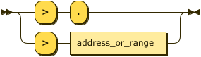
<map name="load_target.map">
    <area shape="rect" coords="99,45,235,77" href="#address_or_range" title="address_or_range">
</map>

<p>
    <div class="ebnf">
        <code>
            <div>
                EBNF: <a href="#load_target" title="load_target">load_target</a>
            </div>
            <div>
                &nbsp;&nbsp;&nbsp;&nbsp;&nbsp;&nbsp;&nbsp;&nbsp;&nbsp;::= '&gt;' ( '.' |
                <a href="#address_or_range" title="address_or_range">address_or_range</a> )
            </div>
        </code>
    </div>
    <div class="ebnf">
        <code>
            <div>
                BNF: <a href="#load_target" title="load_target">load_target</a>
            </div>
            <div>
                &nbsp;&nbsp;&nbsp;&nbsp;&nbsp;&nbsp;&nbsp;&nbsp;&nbsp;::= '&gt;' '.'
            </div>
            <div>
                &nbsp;&nbsp;&nbsp;&nbsp;&nbsp;&nbsp;&nbsp;&nbsp;&nbsp;| '&gt;'
                <a href="#address_or_range" title="address_or_range">address_or_range</a>
            </div>
            <div>
                &nbsp;&nbsp;&nbsp;&nbsp;&nbsp;&nbsp;&nbsp;&nbsp;&nbsp;| '&gt;'
                <a href="#empty" title="empty">empty</a>
            </div>
        </code>
    </div>
</p>

<p>referenced by:
    <ul>
        <li>
            <a href="#load_stmt" title="load_stmt">load_stmt</a>
        </li>
    </ul>
</p><br>

<p style="font-size: 14px; font-weight:bold">
    <a name="section_list">section_list:</a>
</p>

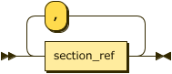
<map name="section_list.map">
    <area shape="rect" coords="49,45,139,77" href="#section_ref" title="section_ref">
</map>

<p>
    <div class="ebnf">
        <code>
            <div>
                EBNF: <a href="#section_list" title="section_list">section_list</a>
            </div>
            <div>
                &nbsp;&nbsp;&nbsp;&nbsp;&nbsp;&nbsp;&nbsp;&nbsp;&nbsp;::=
                <a href="#section_ref" title="section_ref">section_ref</a> ( ','
                <a href="#section_ref" title="section_ref">section_ref</a> )*
            </div>
        </code>
    </div>
    <div class="ebnf">
        <code>
            <div>
                BNF: <a href="#section_list" title="section_list">section_list</a>
            </div>
            <div>
                &nbsp;&nbsp;&nbsp;&nbsp;&nbsp;&nbsp;&nbsp;&nbsp;&nbsp;::=
                <a href="#section_list" title="section_list">section_list</a> ','
                <a href="#section_ref" title="section_ref">section_ref</a>
            </div>
            <div>
                &nbsp;&nbsp;&nbsp;&nbsp;&nbsp;&nbsp;&nbsp;&nbsp;&nbsp;|
                <a href="#section_ref" title="section_ref">section_ref</a>
            </div>
        </code>
    </div>
</p>

<p>referenced by:
    <ul>
        <li>
            <a href="#load_data" title="load_data">load_data</a>
        </li>
    </ul>
</p><br>

<p style="font-size: 14px; font-weight:bold">
    <a name="section_ref">section_ref:</a>
</p>

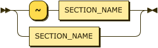
<map name="section_ref.map">
    <area shape="rect" coords="119,1,237,33" href="#SECTION_NAME" title="SECTION_NAME">
</map>

<p>
    <div class="ebnf">
        <code>
            <div>
                EBNF: <a href="#section_ref" title="section_ref">section_ref</a>
            </div>
            <div>
                &nbsp;&nbsp;&nbsp;&nbsp;&nbsp;&nbsp;&nbsp;&nbsp;&nbsp;::= '~'?
                <a href="#SECTION_NAME" title="SECTION_NAME">SECTION_NAME</a>
            </div>
        </code>
    </div>
    <div class="ebnf">
        <code>
            <div>
                BNF: <a href="#section_ref" title="section_ref">section_ref</a>
            </div>
            <div>
                &nbsp;&nbsp;&nbsp;&nbsp;&nbsp;&nbsp;&nbsp;&nbsp;&nbsp;::= '~'
                <a href="#SECTION_NAME" title="SECTION_NAME">SECTION_NAME</a>
            </div>
            <div>
                &nbsp;&nbsp;&nbsp;&nbsp;&nbsp;&nbsp;&nbsp;&nbsp;&nbsp;|
                <a href="#SECTION_NAME" title="SECTION_NAME">SECTION_NAME</a>
            </div>
        </code>
    </div>
</p>

<p>referenced by:
    <ul>
        <li>
            <a href="#section_list" title="section_list">section_list</a>
        </li>
    </ul>
</p><br>


<p style="font-size: 14px; font-weight:bold">
    <a name="erase_stmt">erase_stmt:</a>
</p>

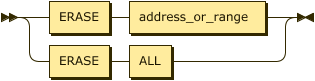
<map name="erase_stmt.map">
    <area shape="rect" coords="29,1,89,33" href="#ERASE" title="ERASE">
    <area shape="rect" coords="129,1,265,33" href="#address_or_range" title="address_or_range">
    <area shape="rect" coords="129,45,171,77" href="#ALL" title="ALL">
</map>

<p>
    <div class="ebnf">
        <code>
            <div>
                EBNF: <a href="#erase_stmt" title="erase_stmt">erase_stmt</a>
            </div>
            <div>
                &nbsp;&nbsp;&nbsp;&nbsp;&nbsp;&nbsp;&nbsp;&nbsp;&nbsp;::=
                <a href="#ERASE" title="ERASE">ERASE</a> (
                <a href="#address_or_range" title="address_or_range">address_or_range</a> |
                <a href="#ALL" title="ALL">ALL</a> )
            </div>
        </code>
    </div>
    <div class="ebnf">
        <code>
            <div>
                BNF: <a href="#erase_stmt" title="erase_stmt">erase_stmt</a>
            </div>
            <div>
                &nbsp;&nbsp;&nbsp;&nbsp;&nbsp;&nbsp;&nbsp;&nbsp;&nbsp;::=
                <a href="#ERASE" title="ERASE">ERASE</a>
                <a href="#address_or_range" title="address_or_range">address_or_range</a>
            </div>
            <div>
                &nbsp;&nbsp;&nbsp;&nbsp;&nbsp;&nbsp;&nbsp;&nbsp;&nbsp;|
                <a href="#ALL" title="ALL">ALL</a>
            </div>
        </code>
    </div>
</p>

<p>referenced by:
    <ul>
        <li>
            <a href="#basic_stmt" title="basic_stmt">basic_stmt</a>
        </li>
    </ul>
</p><br>

<p style="font-size: 14px; font-weight:bold">
    <a name="address_or_range">address_or_range:</a>
</p>

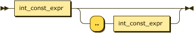
<map name="address_or_range.map">
    <area shape="rect" coords="29,1,143,33" href="#int_const_expr" title="int_const_expr">
    <area shape="rect" coords="231,33,345,65" href="#int_const_expr" title="int_const_expr">
</map>

<p>
    <div class="ebnf">
        <code>
            <div>
                EBNF: <a href="#address_or_range" title="address_or_range">address_or_range</a>
            </div>
            <div>
                &nbsp;&nbsp;&nbsp;&nbsp;&nbsp;&nbsp;&nbsp;&nbsp;&nbsp;::=
                <a href="#int_const_expr" title="int_const_expr">int_const_expr</a> ( '..'
                <a href="#int_const_expr" title="int_const_expr">int_const_expr</a> )?
            </div>
        </code>
    </div>
    <div class="ebnf">
        <code>
            <div>
                BNF: <a href="#address_or_range" title="address_or_range">address_or_range</a>
            </div>
            <div>
                &nbsp;&nbsp;&nbsp;&nbsp;&nbsp;&nbsp;&nbsp;&nbsp;&nbsp;::=
                <a href="#int_const_expr" title="int_const_expr">int_const_expr</a>
            </div>
            <div>
                &nbsp;&nbsp;&nbsp;&nbsp;&nbsp;&nbsp;&nbsp;&nbsp;&nbsp;|
                <a href="#int_const_expr" title="int_const_expr">int_const_expr</a> '..'
                <a href="#int_const_expr" title="int_const_expr">int_const_expr</a>
            </div>
        </code>
    </div>
</p>

<p>referenced by:
    <ul>
        <li>
            <a href="#erase_stmt" title="erase_stmt">erase_stmt</a>
        </li>
        <li>
            <a href="#load_target" title="load_target">load_target</a>
        </li>
    </ul>
</p><br>

<p style="font-size: 14px; font-weight:bold">
    <a name="symbol_ref">symbol_ref:</a>
</p>

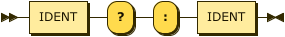
<map name="symbol_ref.map">
    <area shape="rect" coords="29,1,87,33" href="#IDENT" title="IDENT">
    <area shape="rect" coords="197,1,255,33" href="#IDENT" title="IDENT">
</map>

<p>
    <div class="ebnf">
        <code>
            <div>
                EBNF: <a href="#symbol_ref" title="symbol_ref">symbol_ref</a>
            </div>
            <div>
                &nbsp;&nbsp;&nbsp;&nbsp;&nbsp;&nbsp;&nbsp;&nbsp;&nbsp;::=
                <a href="#IDENT" title="IDENT">IDENT</a> '?' ':'
                <a href="#IDENT" title="IDENT">IDENT</a>
            </div>
        </code>
    </div>
    <div class="ebnf">
        <code>
            <div>
                BNF: <a href="#symbol_ref" title="symbol_ref">symbol_ref</a>
            </div>
            <div>
                &nbsp;&nbsp;&nbsp;&nbsp;&nbsp;&nbsp;&nbsp;&nbsp;&nbsp;::=
                <a href="#IDENT" title="IDENT">IDENT</a> '?' ':'
                <a href="#IDENT" title="IDENT">IDENT</a>
            </div>
        </code>
    </div>
</p>

<p>referenced by:
    <ul>
        <li>
            <a href="#call_target" title="call_target">call_target</a>
        </li>
    </ul>
</p><br>

<p style="font-size: 14px; font-weight:bold">
    <a name="load_ifr_stmt">load_ifr_stmt:</a>
</p>


<map name="load_ifr_stmt.map">
    <area shape="rect" coords="29,1,83,33" href="#LOAD" title="LOAD">
    <area shape="rect" coords="103,1,143,33" href="#IFR" title="IFR">
    <area shape="rect" coords="163,1,277,33" href="#int_const_expr" title="int_const_expr">
    <area shape="rect" coords="347,1,461,33" href="#int_const_expr" title="int_const_expr">
</map>

<p>
    <div class="ebnf">
        <code>
            <div>
                EBNF: <a href="#load_ifr_stmt" title="load_ifr_stmt">load_ifr_stmt</a>
            </div>
            <div>
                &nbsp;&nbsp;&nbsp;&nbsp;&nbsp;&nbsp;&nbsp;&nbsp;&nbsp;::=
                <a href="#LOAD" title="LOAD">LOAD</a>
                <a href="#IFR" title="IFR">IFR</a>
                <a href="#int_const_expr" title="int_const_expr">int_const_expr</a> '&gt;'
                <a href="#int_const_expr" title="int_const_expr">int_const_expr</a>
            </div>
        </code>
    </div>
    <div class="ebnf">
        <code>
            <div>
                BNF: <a href="#load_ifr_stmt" title="load_ifr_stmt">load_ifr_stmt</a>
            </div>
            <div>
                &nbsp;&nbsp;&nbsp;&nbsp;&nbsp;&nbsp;&nbsp;&nbsp;&nbsp;::=
                <a href="#LOAD" title="LOAD">LOAD</a>
                <a href="#IFR" title="IFR">IFR</a>
                <a href="#int_const_expr" title="int_const_expr">int_const_expr</a> '&gt;'
                <a href="#int_const_expr" title="int_const_expr">int_const_expr</a>
            </div>
        </code>
    </div>
</p>

<p>referenced by:
    <ul>
        <li>
            <a href="#basic_stmt" title="basic_stmt">basic_stmt</a>
        </li>
    </ul>
</p><br>

<p style="font-size: 14px; font-weight:bold">
    <a name="call_stmt">call_stmt:</a>
</p>

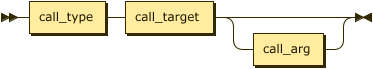
<map name="call_stmt.map">
    <area shape="rect" coords="29,1,105,33" href="#call_type" title="call_type">
    <area shape="rect" coords="125,1,213,33" href="#call_target" title="call_target">
    <area shape="rect" coords="253,33,323,65" href="#call_arg" title="call_arg">
</map>

<p>
    <div class="ebnf">
        <code>
            <div>
                EBNF: <a href="#call_stmt" title="call_stmt">call_stmt</a>
            </div>
            <div>
                &nbsp;&nbsp;&nbsp;&nbsp;&nbsp;&nbsp;&nbsp;&nbsp;&nbsp;::=
                <a href="#call_type" title="call_type">call_type</a>
                <a href="#call_target" title="call_target">call_target</a>
                <a href="#call_arg" title="call_arg">call_arg</a>?
            </div>
        </code>
    </div>
    <div class="ebnf">
        <code>
            <div>
                BNF: <a href="#call_stmt" title="call_stmt">call_stmt</a>
            </div>
            <div>
                &nbsp;&nbsp;&nbsp;&nbsp;&nbsp;&nbsp;&nbsp;&nbsp;&nbsp;::=
                <a href="#call_type" title="call_type">call_type</a>
                <a href="#call_target" title="call_target">call_target</a>
                <a href="#call_arg" title="call_arg">call_arg</a>
            </div>
        </code>
    </div>
</p>

<p>referenced by:
    <ul>
        <li>
            <a href="#basic_stmt" title="basic_stmt">basic_stmt</a>
        </li>
    </ul>
</p><br>

<p style="font-size: 14px; font-weight:bold">
    <a name="call_type">call_type:</a>
</p>

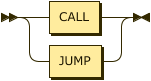
<map name="call_type.map">
    <area shape="rect" coords="49,1,99,33" href="#CALL" title="CALL">
    <area shape="rect" coords="49,45,101,77" href="#JUMP" title="JUMP">
</map>

<p>
    <div class="ebnf">
        <code>
            <div>
                EBNF: <a href="#call_type" title="call_type">call_type</a>
            </div>
            <div>
                &nbsp;&nbsp;&nbsp;&nbsp;&nbsp;&nbsp;&nbsp;&nbsp;&nbsp;::=
                <a href="#CALL" title="CALL">CALL</a>
            </div>
            <div>
                &nbsp;&nbsp;&nbsp;&nbsp;&nbsp;&nbsp;&nbsp;&nbsp;&nbsp;&nbsp;&nbsp;|
                <a href="#JUMP" title="JUMP">JUMP</a>
            </div>
        </code>
    </div>
    <div class="ebnf">
        <code>
            <div>
                BNF: <a href="#call_type" title="call_type">call_type</a>
            </div>
            <div>
                &nbsp;&nbsp;&nbsp;&nbsp;&nbsp;&nbsp;&nbsp;&nbsp;&nbsp;::=
                <a href="#CALL" title="CALL">CALL</a>
            </div>
            <div>
                &nbsp;&nbsp;&nbsp;&nbsp;&nbsp;&nbsp;&nbsp;&nbsp;&nbsp;&nbsp;&nbsp;|
                <a href="#JUMP" title="JUMP">JUMP</a>
            </div>
        </code>
    </div>
</p>

<p>referenced by:
    <ul>
        <li>
            <a href="#call_stmt" title="call_stmt">call_stmt</a>
        </li>
    </ul>
</p><br>

<p style="font-size: 14px; font-weight:bold">
    <a name="call_target">call_target:</a>
</p>


<map name="call_target.map">
    <area shape="rect" coords="49,1,163,33" href="#int_const_expr" title="int_const_expr">
    <area shape="rect" coords="49,45,139,77" href="#symbol_ref" title="symbol_ref">
    <area shape="rect" coords="49,89,107,121" href="#IDENT" title="IDENT">
</map>

<p>
    <div class="ebnf">
        <code>
            <div>
                EBNF: <a href="#call_target" title="call_target">call_target</a>
            </div>
            <div>
                &nbsp;&nbsp;&nbsp;&nbsp;&nbsp;&nbsp;&nbsp;&nbsp;&nbsp;::=
                <a href="#int_const_expr" title="int_const_expr">int_const_expr</a>
            </div>
            <div>
                &nbsp;&nbsp;&nbsp;&nbsp;&nbsp;&nbsp;&nbsp;&nbsp;&nbsp;&nbsp;&nbsp;|
                <a href="#symbol_ref" title="symbol_ref">symbol_ref</a>
            </div>
            <div>
                &nbsp;&nbsp;&nbsp;&nbsp;&nbsp;&nbsp;&nbsp;&nbsp;&nbsp;&nbsp;&nbsp;|
                <a href="#IDENT" title="IDENT">IDENT</a>
            </div>
        </code>
    </div>
    <div class="ebnf">
        <code>
            <div>
                BNF: <a href="#call_target" title="call_target">call_target</a>
            </div>
            <div>
                &nbsp;&nbsp;&nbsp;&nbsp;&nbsp;&nbsp;&nbsp;&nbsp;&nbsp;::=
                <a href="#int_const_expr" title="int_const_expr">int_const_expr</a>
            </div>
            <div>
                &nbsp;&nbsp;&nbsp;&nbsp;&nbsp;&nbsp;&nbsp;&nbsp;&nbsp;&nbsp;&nbsp;|
                <a href="#symbol_ref" title="symbol_ref">symbol_ref</a>
            </div>
            <div>
                &nbsp;&nbsp;&nbsp;&nbsp;&nbsp;&nbsp;&nbsp;&nbsp;&nbsp;&nbsp;&nbsp;|
                <a href="#IDENT" title="IDENT">IDENT</a>
            </div>
        </code>
    </div>
</p>

<p>referenced by:
    <ul>
        <li><a href="#call_stmt" title="call_stmt">call_stmt</a></li>

<li><a href="#jump_sp_stmt" title="jump_sp_stmt">jump_sp_stmt</a></li>
</ul>
</p><br>

<p style="font-size: 14px; font-weight:bold">
    <a name="call_arg">call_arg:</a>
</p>

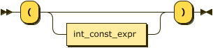
<map name="call_arg.map">
    <area shape="rect" coords="95,33,209,65" href="#int_const_expr" title="int_const_expr">
</map>

<p>
    <div class="ebnf">
        <code>
            <div>
                EBNF: <a href="#call_arg" title="call_arg">call_arg</a>&nbsp;::= '('
                <a href="#int_const_expr" title="int_const_expr">int_const_expr</a>? ')'
            </div>
        </code>
    </div>
    <div class="ebnf">
        <code>
            <div>
                BNF: <a href="#call_arg" title="call_arg">call_arg</a>&nbsp;::= '(' ')'
            </div>
            <div>
                &nbsp;&nbsp;&nbsp;&nbsp;&nbsp;&nbsp;&nbsp;&nbsp;&nbsp;&nbsp;&nbsp;|
                '(' <a href="#int_const_expr" title="int_const_expr">int_const_expr</a> ')'
            </div>
            <div>
                &nbsp;&nbsp;&nbsp;&nbsp;&nbsp;&nbsp;&nbsp;&nbsp;&nbsp;&nbsp;&nbsp;|
                <a href="#empty" title="empty">empty</a>
            </div>
        </code>
    </div>
</p>

<p>referenced by:
    <ul>
        <li>
            <a href="#call_stmt" title="call_stmt">call_stmt</a>
        </li>
        <li>
            <a href="#jump_sp_stmt" title="jump_sp_stmt">jump_sp_stmt</a>
        </li>
    </ul>
</p><br>

<p style="font-size: 14px; font-weight:bold">
    <a name="jump_sp_stmt">jump_sp_stmt:</a>
</p>

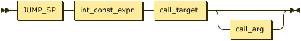
<map name="jump_sp_stmt.map">
    <area shape="rect" coords="29,1,105,33" href="#JUMP_SP" title="JUMP_SP">
    <area shape="rect" coords="125,1,239,33" href="#int_const_expr" title="int_const_expr">
    <area shape="rect" coords="259,1,347,33" href="#call_target" title="call_target">
    <area shape="rect" coords="387,33,457,65" href="#call_arg" title="call_arg">
</map>

<p>
    <div class="ebnf">
        <code>
            <div>
                EBNF: <a href="#jump_sp_stmt" title="jump_sp_stmt">jump_sp_stmt</a>
            </div>
            <div>
                &nbsp;&nbsp;&nbsp;&nbsp;&nbsp;&nbsp;&nbsp;&nbsp;&nbsp;::=
                <a href="#JUMP_SP" title="JUMP_SP">JUMP_SP</a>
                <a href="#int_const_expr" title="int_const_expr">int_const_expr</a>
                <a href="#call_target" title="call_target">call_target</a>
                <a href="#call_arg" title="call_arg">call_arg</a>?
            </div>
        </code>
    </div>
    <div class="ebnf">
        <code>
            <div>
                BNF: <a href="#jump_sp_stmt" title="jump_sp_stmt">jump_sp_stmt</a>
            </div>
            <div>
                &nbsp;&nbsp;&nbsp;&nbsp;&nbsp;&nbsp;&nbsp;&nbsp;&nbsp;::=
                <a href="#JUMP_SP" title="JUMP_SP">JUMP_SP</a>
                <a href="#int_const_expr" title="int_const_expr">int_const_expr</a>
                <a href="#call_target" title="call_target">call_target</a>
                <a href="#call_arg" title="call_arg">call_arg</a>
            </div>
        </code>
    </div>
</p>

<p>referenced by:
    <ul>
        <li>
            <a href="#basic_stmt" title="basic_stmt">basic_stmt</a>
        </li>
    </ul>
</p><br>

<p style="font-size: 14px; font-weight:bold">
    <a name="from_stmt">from_stmt:</a>
</p>

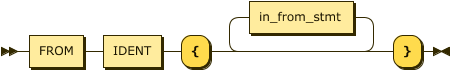
<map name="from_stmt.map">
    <area shape="rect" coords="29,35,83,67" href="#FROM" title="FROM">
    <area shape="rect" coords="103,35,161,67" href="#IDENT" title="IDENT">
    <area shape="rect" coords="249,1,353,33" href="#in_from_stmt" title="in_from_stmt">
</map>

<p>
    <div class="ebnf">
        <code>
            <div>
                EBNF: <a href="#from_stmt" title="from_stmt">from_stmt</a>
            </div>
            <div>
                &nbsp;&nbsp;&nbsp;&nbsp;&nbsp;&nbsp;&nbsp;&nbsp;&nbsp;::=
                <a href="#FROM" title="FROM">FROM</a>
                <a href="#IDENT" title="IDENT">IDENT</a> '{'
                <a href="#in_from_stmt" title="in_from_stmt">in_from_stmt</a>* '}'
            </div>
        </code>
    </div>
    <div class="ebnf">
        <code>
            <div>
                BNF: <a href="#from_stmt" title="from_stmt">from_stmt</a>
            </div>
            <div>
                &nbsp;&nbsp;&nbsp;&nbsp;&nbsp;&nbsp;&nbsp;&nbsp;&nbsp;::=
                <a href="#FROM" title="FROM">FROM</a>
                <a href="#IDENT" title="IDENT">IDENT</a> '{'
                <a href="#in_from_stmt" title="in_from_stmt">in_from_stmt</a> '}'
            </div>
        </code>
    </div>
</p>

<p>referenced by:
    <ul>
        <li>
            <a href="#statement" title="statement">statement</a>
        </li>
    </ul>
</p><br>

<p style="font-size: 14px; font-weight:bold">
    <a name="in_from_stmt">in_from_stmt:</a>
</p>

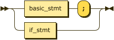
<map name="in_from_stmt.map">
    <area shape="rect" coords="49,1,137,33" href="#basic_stmt" title="basic_stmt">
    <area shape="rect" coords="49,45,113,77" href="#if_stmt" title="if_stmt">
</map>

<p>
    <div class="ebnf">
        <code>
            <div>
                EBNF: <a href="#in_from_stmt" title="in_from_stmt">in_from_stmt</a>
            </div>
            <div>
                &nbsp;&nbsp;&nbsp;&nbsp;&nbsp;&nbsp;&nbsp;&nbsp;&nbsp;::=
                <a href="#basic_stmt" title="basic_stmt">basic_stmt</a> ';'
            </div>
            <div>
                &nbsp;&nbsp;&nbsp;&nbsp;&nbsp;&nbsp;&nbsp;&nbsp;&nbsp;&nbsp;&nbsp;|
                <a href="#if_stmt" title="if_stmt">if_stmt</a>
            </div>
        </code>
    </div>
    <div class="ebnf">
        <code>
            <div>
                BNF: <a href="#in_from_stmt" title="in_from_stmt">in_from_stmt</a>
            </div>
            <div>
                &nbsp;&nbsp;&nbsp;&nbsp;&nbsp;&nbsp;&nbsp;&nbsp;&nbsp;::=
                <a href="#in_from_stmt" title="in_from_stmt">in_from_stmt</a>
                <a href="#basic_stmt" title="basic_stmt">basic_stmt</a> ';'
            </div>
            <div>
                &nbsp;&nbsp;&nbsp;&nbsp;&nbsp;&nbsp;&nbsp;&nbsp;&nbsp;&nbsp;&nbsp;|
                <a href="#in_from_stmt" title="in_from_stmt">in_from_stmt</a>
                <a href="#if_stmt" title="if_stmt">if_stmt</a>
            </div>
            <div>
                &nbsp;&nbsp;&nbsp;&nbsp;&nbsp;&nbsp;&nbsp;&nbsp;&nbsp;&nbsp;&nbsp;|
                <a href="#empty" title="empty">empty</a>
            </div>
        </code>
    </div>
</p>

<p>referenced by:
    <ul>
        <li>
            <a href="#from_stmt" title="from_stmt">from_stmt</a>
        </li>
    </ul>
</p><br>

<p style="font-size: 14px; font-weight:bold">
    <a name="mode_stmt">mode_stmt:</a>
</p>

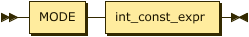
<map name="mode_stmt.map">
    <area shape="rect" coords="29,1,85,33" href="#MODE" title="MODE">
    <area shape="rect" coords="105,1,219,33" href="#int_const_expr" title="int_const_expr">
</map>

<p>
    <div class="ebnf">
        <code>
            <div>
                EBNF: <a href="#mode_stmt" title="mode_stmt">mode_stmt</a>
            </div>
            <div>
                &nbsp;&nbsp;&nbsp;&nbsp;&nbsp;&nbsp;&nbsp;&nbsp;&nbsp;::=
                <a href="#MODE" title="MODE">MODE</a>
                <a href="#int_const_expr" title="int_const_expr">int_const_expr</a>
            </div>
        </code>
    </div>
    <div class="ebnf">
        <code>
            <div>
                BNF: <a href="#mode_stmt" title="mode_stmt">mode_stmt</a>
            </div>
            <div>
                &nbsp;&nbsp;&nbsp;&nbsp;&nbsp;&nbsp;&nbsp;&nbsp;&nbsp;::=
                <a href="#MODE" title="MODE">MODE</a>
                <a href="#int_const_expr" title="int_const_expr">int_const_expr</a>
            </div>
        </code>
    </div>
</p>

<p>referenced by:
    <ul>
        <li>
            <a href="#basic_stmt" title="basic_stmt">basic_stmt</a>
        </li>
    </ul>
</p><br>

<p style="font-size: 14px; font-weight:bold">
    <a name="message_stmt">message_stmt:</a>
</p>

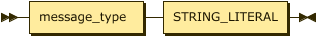
<map name="message_stmt.map">
    <area shape="rect" coords="29,1,135,33" href="#message_typ" title="message_typ">
    <area shape="rect" coords="155,1,279,33" href="#STRING_LITERAL" title="STRING_LITERAL">
</map>

<p>
    <div class="ebnf">
        <code>
            <div>
                EBNF: <a href="#message_stmt" title="message_stmt">message_stmt</a>
            </div>
            <div>
                &nbsp;&nbsp;&nbsp;&nbsp;&nbsp;&nbsp;&nbsp;&nbsp;&nbsp;::=
                <a href="#message_typ" title="message_typ">message_type</a>
                <a href="#STRING_LITERAL" title="STRING_LITERAL">STRING_LITERAL</a>
            </div>
        </code>
    </div>
    <div class="ebnf">
        <code>
            <div>
                BNF: <a href="#message_stmt" title="message_stmt">message_stmt</a>
            </div>
            <div>
                &nbsp;&nbsp;&nbsp;&nbsp;&nbsp;&nbsp;&nbsp;&nbsp;&nbsp;::=
                <a href="#message_typ" title="message_typ">message_type</a>
                <a href="#STRING_LITERAL" title="STRING_LITERAL">STRING_LITERAL</a>
            </div>
        </code>
    </div>
</p>

<p>referenced by:
    <ul>
        <li>
            <a href="#basic_stmt" title="basic_stmt">basic_stmt</a>
        </li>
    </ul>
</p><br>

<p style="font-size: 14px; font-weight:bold">
    <a name="message_type">message_type:</a>
</p>

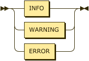
<map name="message_type.map">
    <area shape="rect" coords="49,1,99,33" href="#INFO" title="INFO">
    <area shape="rect" coords="49,45,131,77" href="#WARNING" title="WARNING">
    <area shape="rect" coords="49,89,111,121" href="#ERROR" title="ERROR">
</map>

<p>
    <div class="ebnf">
        <code>
            <div>
                EBNF: <a href="#message_type" title="message_type">message_type</a>
            </div>
            <div>
                &nbsp;&nbsp;&nbsp;&nbsp;&nbsp;&nbsp;&nbsp;&nbsp;&nbsp;::=
                <a href="#INFO" title="INFO">INFO</a>
            </div>
            <div>
                &nbsp;&nbsp;&nbsp;&nbsp;&nbsp;&nbsp;&nbsp;&nbsp;&nbsp;&nbsp;&nbsp;|
                <a href="#WARNING" title="WARNING">WARNING</a>
            </div>
            <div>
                &nbsp;&nbsp;&nbsp;&nbsp;&nbsp;&nbsp;&nbsp;&nbsp;&nbsp;&nbsp;&nbsp;|
                <a href="#ERROR" title="ERROR">ERROR</a>
            </div>
        </code>
    </div>
    <div class="ebnf">
        <code>
            <div>
                BNF: <a href="#message_type" title="message_type">message_type</a>
            </div>
            <div>
                &nbsp;&nbsp;&nbsp;&nbsp;&nbsp;&nbsp;&nbsp;&nbsp;&nbsp;::=
                <a href="#INFO" title="INFO">INFO</a>
            </div>
            <div>
                &nbsp;&nbsp;&nbsp;&nbsp;&nbsp;&nbsp;&nbsp;&nbsp;&nbsp;&nbsp;&nbsp;|
                <a href="#WARNING" title="WARNING">WARNING</a>
            </div>
            <div>
                &nbsp;&nbsp;&nbsp;&nbsp;&nbsp;&nbsp;&nbsp;&nbsp;&nbsp;&nbsp;&nbsp;|
                <a href="#ERROR" title="ERROR">ERROR</a>
            </div>
        </code>
    </div>
</p>

<p>no references</p><br>

<p style="font-size: 14px; font-weight:bold">
    <a name="if_stmt">if_stmt:</a>
</p>

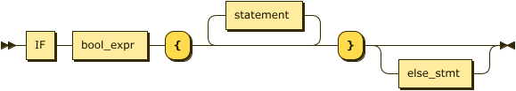
<map name="if_stmt.map">
    <area shape="rect" coords="29,35,61,67" href="#IF" title="IF">
    <area shape="rect" coords="81,35,165,67" href="#bool_expr" title="bool_expr">
    <area shape="rect" coords="253,1,339,33" href="#statement" title="statement">
    <area shape="rect" coords="447,67,529,99" href="#else_stmt" title="else_stmt">
</map>

<p>
    <div class="ebnf">
        <code>
            <div>
                EBNF: <a href="#if_stmt" title="if_stmt">if_stmt</a>
                &nbsp;&nbsp;::=
                <a href="#IF" title="IF">IF</a>
                <a href="#bool_expr" title="bool_expr">bool_expr</a> '{'
                <a href="#statement" title="statement">statement</a>* '}'
                <a href="#else_stmt" title="else_stmt">else_stmt</a>?
            </div>
        </code>
    </div>
    <div class="ebnf">
        <code>
            <div>
                BNF: <a href="#if_stmt" title="if_stmt">if_stmt</a>
                &nbsp;&nbsp;::=
                <a href="#IF" title="IF">IF</a>
                <a href="#bool_expr" title="bool_expr">bool_expr</a> '{'
                <a href="#statement" title="statement">statement</a> '}'
                <a href="#else_stmt" title="else_stmt">else_stmt</a>
            </div>
        </code>
    </div>
</p>

<p>referenced by:
    <ul>
        <li>
            <a href="#else_stmt" title="else_stmt">else_stmt</a>
        </li>
        <li>
            <a href="#in_from_stmt" title="in_from_stmt">in_from_stmt</a>
        </li>
        <li>
            <a href="#statement" title="statement">statement</a>
        </li>
    </ul>
</p><br>

<p style="font-size: 14px; font-weight:bold">
    <a name="else_stmt">else_stmt:</a>
</p>

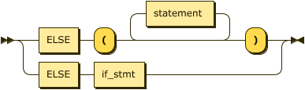
<map name="else_stmt.map">
    <area shape="rect" coords="29,35,79,67" href="#ELSE" title="ELSE">
    <area shape="rect" coords="185,1,271,33" href="#statement" title="statement">
    <area shape="rect" coords="119,79,183,111" href="#if_stmt" title="if_stmt">
</map>

<p>
    <div class="ebnf">
        <code>
            <div>
                EBNF: <a href="#else_stmt" title="else_stmt">else_stmt</a>
            </div>
            <div>
                &nbsp;&nbsp;&nbsp;&nbsp;&nbsp;&nbsp;&nbsp;&nbsp;&nbsp;::=
                <a href="#ELSE" title="ELSE">ELSE</a> ( '('
                <a href="#statement" title="statement">statement</a>* ')' |
                <a href="#if_stmt" title="if_stmt">if_stmt</a> )
            </div>
        </code>
    </div>
    <div class="ebnf">
        <code>
            <div>
                BNF: <a href="#else_stmt" title="else_stmt">else_stmt</a>
            </div>
            <div>
                &nbsp;&nbsp;&nbsp;&nbsp;&nbsp;&nbsp;&nbsp;&nbsp;&nbsp;::=
                <a href="#ELSE" title="ELSE">ELSE</a> '('
                <a href="#statement" title="statement">statement</a> ')'
            </div>
            <div>
                &nbsp;&nbsp;&nbsp;&nbsp;&nbsp;&nbsp;&nbsp;&nbsp;&nbsp;|
                <a href="#ELSE" title="ELSE">ELSE</a>
                <a href="#if_stmt" title="if_stmt">if_stmt</a>
            </div>
            <div>
                &nbsp;&nbsp;&nbsp;&nbsp;&nbsp;&nbsp;&nbsp;&nbsp;&nbsp;|
                <a href="#empty" title="empty">empty</a>
            </div>
        </code>
    </div>
</p>

<p>referenced by:
    <ul>
        <li>
            <a href="#if_stmt" title="if_stmt">if_stmt</a>
        </li>
    </ul>
</p><br>

<p style="font-size: 14px; font-weight:bold">
    <a name="encrypt_stmt">encrypt_stmt:</a>
</p>


<map name="encrypt_stmt.map">
    <area shape="rect" coords="29,35,105,67" href="#ENCRYPT" title="ENCRYPT">
    <area shape="rect" coords="171,35,285,67" href="#int_const_expr" title="int_const_expr">
    <area shape="rect" coords="419,1,505,33" href="#statement" title="statement">
</map>

<p>
    <div class="ebnf">
        <code>
            <div>
                EBNF: <a href="#encrypt_stmt" title="encrypt_stmt">encrypt_stmt</a>
            </div>
            <div>
                &nbsp;&nbsp;&nbsp;&nbsp;&nbsp;&nbsp;&nbsp;&nbsp;&nbsp;::=
                <a href="#ENCRYPT" title="ENCRYPT">ENCRYPT</a> '('
                <a href="#int_const_expr" title="int_const_expr">int_const_expr</a> ')' '{'
                <a href="#statement" title="statement">statement</a>* '}'
            </div>
        </code>
    </div>
    <div class="ebnf">
        <code>
            <div>
                BNF: <a href="#encrypt_stmt" title="encrypt_stmt">encrypt_stmt</a>
            </div>
            <div>
                &nbsp;&nbsp;&nbsp;&nbsp;&nbsp;&nbsp;&nbsp;&nbsp;&nbsp;::=
                <a href="#ENCRYPT" title="ENCRYPT">ENCRYPT</a> '('
                <a href="#int_const_expr" title="int_const_expr">int_const_expr</a> ')' '{'
                <a href="#statement" title="statement">statement</a> '}'
            </div>
        </code>
    </div>
</p>

<p>referenced by:
    <ul>
        <li>
            <a href="#basic_stmt" title="basic_stmt">basic_stmt</a>
        </li>
    </ul>
</p><br>

<p style="font-size: 14px; font-weight:bold">
    <a name="enable_stmt">enable_stmt:</a>
</p>

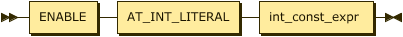
<map name="enable_stmt.map">
    <area shape="rect" coords="29,1,97,33" href="#ENABLE" title="ENABLE">
    <area shape="rect" coords="117,1,239,33" href="#AT_INT_LITERAL" title="AT_INT_LITERAL">
    <area shape="rect" coords="259,1,373,33" href="#int_const_expr" title="int_const_expr">
</map>

<p>
    <div class="ebnf">
        <code>
            <div>
                EBNF: <a href="#enable_stmt" title="enable_stmt">enable_stmt</a>
            </div>
            <div>
                &nbsp;&nbsp;&nbsp;&nbsp;&nbsp;&nbsp;&nbsp;&nbsp;&nbsp;::=
                <a href="#ENABLE" title="ENABLE">ENABLE</a>
                <a href="#AT_INT_LITERAL" title="AT_INT_LITERAL">AT_INT_LITERAL</a>
                <a href="#int_const_expr" title="int_const_expr">int_const_expr</a>
            </div>
        </code>
    </div>
    <div class="ebnf">
        <code>
            <div>
                BNF: <a href="#enable_stmt" title="enable_stmt">enable_stmt</a>
            </div>
            <div>
                &nbsp;&nbsp;&nbsp;&nbsp;&nbsp;&nbsp;&nbsp;&nbsp;&nbsp;::=
                <a href="#ENABLE" title="ENABLE">ENABLE</a>
                <a href="#AT_INT_LITERAL" title="AT_INT_LITERAL">AT_INT_LITERAL</a>
                <a href="#int_const_expr" title="int_const_expr">int_const_expr</a>
            </div>
        </code>
    </div>
</p>

<p>referenced by:
    <ul>
        <li>
            <a href="#basic_stmt" title="basic_stmt">basic_stmt</a>
        </li>
    </ul>
</p><br>

<p style="font-size: 14px; font-weight:bold">
    <a name="reset_stmt">reset_stmt:</a>
</p>

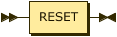
<map name="reset_stmt.map">
    <area shape="rect" coords="29,1,87,33" href="#RESET" title="RESET">
</map>

<p>
    <div class="ebnf">
        <code>
            <div>
                EBNF: <a href="#reset_stmt" title="reset_stmt">reset_stmt</a>
            </div>
            <div>&nbsp;&nbsp;&nbsp;&nbsp;&nbsp;&nbsp;&nbsp;&nbsp;&nbsp;::=
                <a href="#RESET" title="RESET">RESET</a>
            </div>
        </code>
    </div>
    <div class="ebnf">
        <code>
            <div>
                BNF: <a href="#reset_stmt" title="reset_stmt">reset_stmt</a>
            </div>
            <div>&nbsp;&nbsp;&nbsp;&nbsp;&nbsp;&nbsp;&nbsp;&nbsp;&nbsp;::=
                <a href="#RESET" title="RESET">RESET</a>
            </div>
        </code>
    </div>
</p>

<p>referenced by:
    <ul>
        <li>
            <a href="#basic_stmt" title="basic_stmt">basic_stmt</a>
        </li>
    </ul>
</p><br>

<p style="font-size: 14px; font-weight:bold">
    <a name="const_expr">const_expr:</a>
</p>

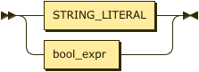
<map name="const_expr.map">
    <area shape="rect" coords="49,1,173,33" href="#STRING_LITERAL" title="STRING_LITERAL">
    <area shape="rect" coords="49,45,133,77" href="#bool_expr" title="bool_expr">
</map>

<p>
    <div class="ebnf">
        <code>
            <div>
                EBNF: <a href="#const_expr" title="const_expr">const_expr</a>
            </div>
            <div>
                &nbsp;&nbsp;&nbsp;&nbsp;&nbsp;&nbsp;&nbsp;&nbsp;&nbsp;::=
                <a href="#STRING_LITERAL" title="STRING_LITERAL">STRING_LITERAL</a>
            </div>
            <div>
                &nbsp;&nbsp;&nbsp;&nbsp;&nbsp;&nbsp;&nbsp;&nbsp;&nbsp;&nbsp;&nbsp;|
                <a href="#bool_expr" title="bool_expr">bool_expr</a>
            </div>
        </code>
    </div>
    <div class="ebnf">
        <code>
            <div>
                BNF: <a href="#const_expr" title="const_expr">const_expr</a>
            </div>
            <div>
                &nbsp;&nbsp;&nbsp;&nbsp;&nbsp;&nbsp;&nbsp;&nbsp;&nbsp;::=
                <a href="#STRING_LITERAL" title="STRING_LITERAL">STRING_LITERAL</a>
            </div>
            <div>
                &nbsp;&nbsp;&nbsp;&nbsp;&nbsp;&nbsp;&nbsp;&nbsp;&nbsp;&nbsp;&nbsp;|
                <a href="#bool_expr" title="bool_expr">bool_expr</a>
            </div>
        </code>
    </div>
</p>

<p>referenced by:
    <ul>
        <li>
            <a href="#option_def" title="option_def">option_def</a>
        </li>
        <li>
            <a href="#option_list" title="option_list">option_list</a>
        </li>
    </ul>
</p><br>

<p style="font-size: 14px; font-weight:bold">
    <a name="int_const_expr">int_const_expr:</a>
</p>

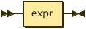
<map name="int_const_expr.map">
    <area shape="rect" coords="29,1,77,33" href="#expr" title="expr">
</map>

<p>
    <div class="ebnf">
        <code>
            <div>
                EBNF: <a href="#int_const_expr" title="int_const_expr">int_const_expr</a>
            </div>
            <div>
                &nbsp;&nbsp;&nbsp;&nbsp;&nbsp;&nbsp;&nbsp;&nbsp;&nbsp;::=
                <a href="#expr" title="expr">expr</a>
            </div>
        </code>
    </div>
    <div class="ebnf">
        <code>
            <div>
                BNF: <a href="#int_const_expr" title="int_const_expr">int_const_expr</a>
            </div>
            <div>
                &nbsp;&nbsp;&nbsp;&nbsp;&nbsp;&nbsp;&nbsp;&nbsp;&nbsp;::=
                <a href="#expr" title="expr">expr</a>
            </div>
        </code>
    </div>
</p>

<p>referenced by:
    <ul>
        <li>
            <a href="#address_or_range" title="address_or_range">address_or_range</a>
        </li>
        <li>
            <a href="#bool_expr" title="bool_expr">bool_expr</a>
        </li>
        <li>
            <a href="#call_arg" title="call_arg">call_arg</a>
        </li>
        <li>
            <a href="#call_target" title="call_target">call_target</a>
        </li>
        <li>
            <a href="#enable_stmt" title="enable_stmt">enable_stmt</a>
        </li>
        <li>
            <a href="#encrypt_stmt" title="encrypt_stmt">encrypt_stmt</a>
        </li>
        <li>
            <a href="#jump_sp_stmt" title="jump_sp_stmt">jump_sp_stmt</a>
        </li>
        <li>
            <a href="#keyblob_block" title="keyblob_block">keyblob_block</a>
        </li>
        <li>
            <a href="#load_data" title="load_data">load_data</a>
        </li>
        <li>
            <a href="#load_ifr_stmt" title="load_ifr_stmt">load_ifr_stmt</a>
        </li>
        <li>
            <a href="#mode_stmt" title="mode_stmt">mode_stmt</a>
        </li>
        <li>
            <a href="#section_block" title="section_block">section_block</a>
        </li>
        <li>
            <a href="#source_value" title="source_value">source_value</a>
        </li>
</ul>
</p><br>

<p style="font-size: 14px; font-weight:bold">
    <a name="bool_expr">bool_expr:</a>
</p>

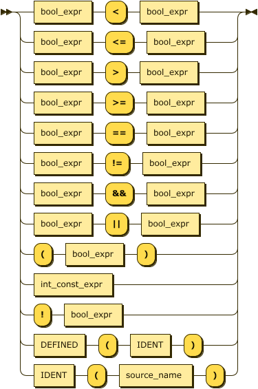
<map name="bool_expr.map">
    <area shape="rect" coords="69,1,153,33" href="#bool_expr" title="bool_expr">
    <area shape="rect" coords="293,1,377,33" href="#bool_expr" title="bool_expr">
    <area shape="rect" coords="115,397,199,429" href="#bool_expr" title="bool_expr">
    <area shape="rect" coords="69,441,143,473" href="#DEFINED" title="DEFINED">
    <area shape="rect" coords="209,441,267,473" href="#IDENT" title="IDENT">
    <area shape="rect" coords="69,485,127,517" href="#IDENT" title="IDENT">
    <area shape="rect" coords="193,485,299,517" href="#source_name" title="source_name">
    <area shape="rect" coords="49,529,163,561" href="#int_const_expr" title="int_const_expr">
</map>

<p>
    <div class="ebnf">
        <code>
            <div>
                EBNF: <a href="#bool_expr" title="bool_expr">bool_expr</a>
            </div>
            <div>
                &nbsp;&nbsp;&nbsp;&nbsp;&nbsp;&nbsp;&nbsp;&nbsp;&nbsp;::= (
                <a href="#bool_expr" title="bool_expr">bool_expr</a>
                ( '&lt;' | '&lt;=' | '&gt;' | '&gt;=' | '==' | '!=' | '&amp;&amp;' | '||' ) | '!' )
                <a href="#bool_expr" title="bool_expr">bool_expr</a>
            </div>
            <div>
                &nbsp;&nbsp;&nbsp;&nbsp;&nbsp;&nbsp;&nbsp;&nbsp;&nbsp;&nbsp;&nbsp;| ( '('
                <a href="#bool_expr" title="bool_expr">bool_expr</a> |
                <a href="#DEFINED" title="DEFINED">DEFINED</a> '('
                <a href="#IDENT" title="IDENT">IDENT</a> |
                <a href="#IDENT" title="IDENT">IDENT</a> '('
                <a href="#source_name" title="source_name">source_name</a> ) ')'
            </div>
            <div>
                &nbsp;&nbsp;&nbsp;&nbsp;&nbsp;&nbsp;&nbsp;&nbsp;&nbsp;&nbsp;&nbsp;|
                <a href="#int_const_expr" title="int_const_expr">int_const_expr</a>
            </div>
        </code>
    </div>
    <div class="ebnf">
        <code>
            <div>
                BNF: <a href="#bool_expr" title="bool_expr">bool_expr</a>
            </div>
            <div>
                &nbsp;&nbsp;&nbsp;&nbsp;&nbsp;&nbsp;&nbsp;&nbsp;&nbsp;::=
                <a href="#bool_expr" title="bool_expr">bool_expr</a>'&lt;' <a href="#bool_expr" title="bool_expr">bool_expr</a>
            </div>
            <div>
                &nbsp;&nbsp;&nbsp;&nbsp;&nbsp;&nbsp;&nbsp;&nbsp;&nbsp;|
                <a href="#bool_expr" title="bool_expr">bool_expr</a>'&lt;=' <a href="#bool_expr" title="bool_expr">bool_expr</a>
            </div>
            <div>
                &nbsp;&nbsp;&nbsp;&nbsp;&nbsp;&nbsp;&nbsp;&nbsp;&nbsp;|
                <a href="#bool_expr" title="bool_expr">bool_expr</a>'&gt;' <a href="#bool_expr" title="bool_expr">bool_expr</a>
            </div>
            <div>
                &nbsp;&nbsp;&nbsp;&nbsp;&nbsp;&nbsp;&nbsp;&nbsp;&nbsp;|
                <a href="#bool_expr" title="bool_expr">bool_expr</a>'&gt;=' <a href="#bool_expr" title="bool_expr">bool_expr</a>
            </div>
            <div>
                &nbsp;&nbsp;&nbsp;&nbsp;&nbsp;&nbsp;&nbsp;&nbsp;&nbsp;|
                <a href="#bool_expr" title="bool_expr">bool_expr</a>'==' <a href="#bool_expr" title="bool_expr">bool_expr</a>
            </div>
            <div>
                &nbsp;&nbsp;&nbsp;&nbsp;&nbsp;&nbsp;&nbsp;&nbsp;&nbsp;|
                <a href="#bool_expr" title="bool_expr">bool_expr</a>'!=' <a href="#bool_expr" title="bool_expr">bool_expr</a>
            </div>
            <div>
                &nbsp;&nbsp;&nbsp;&nbsp;&nbsp;&nbsp;&nbsp;&nbsp;&nbsp;|
                <a href="#bool_expr" title="bool_expr">bool_expr</a>'&amp;&amp;' <a href="#bool_expr" title="bool_expr">bool_expr</a>
            </div>
            <div>
                &nbsp;&nbsp;&nbsp;&nbsp;&nbsp;&nbsp;&nbsp;&nbsp;&nbsp;|
                <a href="#bool_expr" title="bool_expr">bool_expr</a>'||' <a href="#bool_expr" title="bool_expr">bool_expr</a>
            </div>
            <div>
                &nbsp;&nbsp;&nbsp;&nbsp;&nbsp;&nbsp;&nbsp;&nbsp;&nbsp;|
                '(' <a href="#bool_expr" title="bool_expr">bool_expr</a> ')'
            </div>
            <div>
                &nbsp;&nbsp;&nbsp;&nbsp;&nbsp;&nbsp;&nbsp;&nbsp;&nbsp;|
                <a href="#int_const_expr" title="int_const_expr">int_const_expr</a>
            </div>
            <div>
                &nbsp;&nbsp;&nbsp;&nbsp;&nbsp;&nbsp;&nbsp;&nbsp;&nbsp;|
                '!' <a href="#bool_expr" title="bool_expr">bool_expr</a>
            </div>
            <div>
                &nbsp;&nbsp;&nbsp;&nbsp;&nbsp;&nbsp;&nbsp;&nbsp;&nbsp;|
                <a href="#DEFINED" title="DEFINED">DEFINED</a> '(' <a href="#IDENT" title="IDENT">IDENT</a> ')'
            </div>
            <div>
                &nbsp;&nbsp;&nbsp;&nbsp;&nbsp;&nbsp;&nbsp;&nbsp;&nbsp;|
                <a href="#IDENT" title="IDENT">IDENT</a> '('
                <a href="#IDENT" title="IDENT">IDENT</a> ')'
            </div>
        </code>
    </div>
</p>

<p>referenced by:
    <ul>
        <li>
            <a href="#bool_expr" title="bool_expr">bool_expr</a>
        </li>
        <li>
            <a href="#const_expr" title="const_expr">const_expr</a>
        </li>
        <li>
            <a href="#if_stmt" title="if_stmt">if_stmt</a>
        </li>
    </ul>
</p><br>

<p style="font-size: 14px; font-weight:bold">
    <a name="expr">expr:</a>
</p>

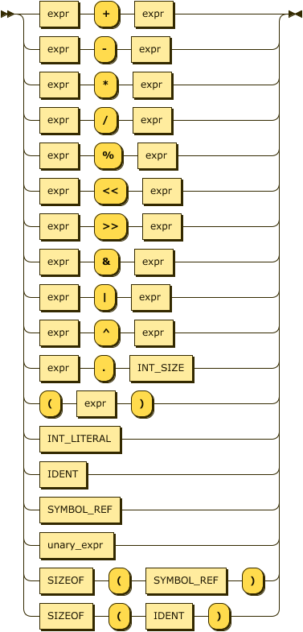
<map name="expr.map">
    <area shape="rect" coords="49,1,97,33" href="#expr" title="expr">
    <area shape="rect" coords="237,1,285,33" href="#expr" title="expr">
    <area shape="rect" coords="181,441,259,473" href="#INT_SIZE" title="INT_SIZE">
    <area shape="rect" coords="115,485,163,517" href="#expr" title="expr">
    <area shape="rect" coords="69,529,135,561" href="#SIZEOF" title="SIZEOF">
    <area shape="rect" coords="221,529,321,561" href="#SYMBOL_REF" title="SYMBOL_REF">
    <area shape="rect" coords="221,573,279,605" href="#IDENT" title="IDENT">
    <area shape="rect" coords="49,617,149,649" href="#INT_LITERAL" title="INT_LITERAL">
    <area shape="rect" coords="49,661,107,693" href="#IDENT" title="IDENT">
    <area shape="rect" coords="49,705,149,737" href="#SYMBOL_REF" title="SYMBOL_REF">
    <area shape="rect" coords="49,749,141,781" href="#unary_expr" title="unary_expr">
</map>

<p>
    <div class="ebnf">
        <code>
            <div>
                EBNF: <a href="#expr" title="expr">expr</a>
            </div>
            <div>
                &nbsp;&nbsp;&nbsp;&nbsp;&nbsp;&nbsp;&nbsp;&nbsp;&nbsp;&nbsp;&nbsp;::=
                <a href="#expr" title="expr">expr</a>
                ( ( '+' | '-' | '*' | '/' | '%' | '&lt;&lt;' | '&gt;&gt;' | '&amp;' | '|' | '^' ) <a href="#expr" title="expr">expr</a>
                | '.'
                <a href="#INT_SIZE" title="INT_SIZE">INT_SIZE</a> )
            </div>
            <div>
                &nbsp;&nbsp;&nbsp;&nbsp;&nbsp;&nbsp;&nbsp;&nbsp;&nbsp;&nbsp;&nbsp;| ( '('
                <a href="#expr" title="expr">expr</a> |
                <a href="#SIZEOF" title="SIZEOF">SIZEOF</a> '(' (
                <a href="#SYMBOL_REF" title="SYMBOL_REF">SYMBOL_REF</a> |
                <a href="#IDENT" title="IDENT">IDENT</a> ) ) ')'
            </div>
            <div>
                &nbsp;&nbsp;&nbsp;&nbsp;&nbsp;&nbsp;&nbsp;&nbsp;&nbsp;&nbsp;&nbsp;|
                <a href="#INT_LITERAL" title="INT_LITERAL">INT_LITERAL</a>
            </div>
            <div>
                &nbsp;&nbsp;&nbsp;&nbsp;&nbsp;&nbsp;&nbsp;&nbsp;&nbsp;&nbsp;&nbsp;|
                <a href="#IDENT" title="IDENT">IDENT</a>
            </div>
            <div>
                &nbsp;&nbsp;&nbsp;&nbsp;&nbsp;&nbsp;&nbsp;&nbsp;&nbsp;&nbsp;&nbsp;|
                <a href="#SYMBOL_REF" title="SYMBOL_REF">SYMBOL_REF</a>
            </div>
            <div>
                &nbsp;&nbsp;&nbsp;&nbsp;&nbsp;&nbsp;&nbsp;&nbsp;&nbsp;&nbsp;&nbsp;|
                <a href="#unary_expr" title="unary_expr">unary_expr</a>
            </div>
        </code>
    </div>
    <div class="ebnf">
        <code>
            <div>
                BNF: <a href="#expr" title="expr">expr</a>
            </div>
            <div>
                &nbsp;&nbsp;&nbsp;&nbsp;&nbsp;::=
                <a href="#expr" title="expr">expr</a> '+' <a href="#expr" title="expr">expr</a>
            </div>
            <div>
                &nbsp;&nbsp;&nbsp;&nbsp;&nbsp;|
                <a href="#expr" title="expr">expr</a> '-' <a href="#expr" title="expr">expr</a>
            </div>
            <div>
                &nbsp;&nbsp;&nbsp;&nbsp;&nbsp;|
                <a href="#expr" title="expr">expr</a> '*' <a href="#expr" title="expr">expr</a>
            </div>
            <div>
                &nbsp;&nbsp;&nbsp;&nbsp;&nbsp;|
                <a href="#expr" title="expr">expr</a> '/' <a href="#expr" title="expr">expr</a>
            </div>
            <div>
                &nbsp;&nbsp;&nbsp;&nbsp;&nbsp;|
                <a href="#expr" title="expr">expr</a> '%' <a href="#expr" title="expr">expr</a>
            </div>
            <div>
                &nbsp;&nbsp;&nbsp;&nbsp;&nbsp;|
                <a href="#expr" title="expr">expr</a> '&lt;&lt;' <a href="#expr" title="expr">expr</a>
            </div>
            <div>
                &nbsp;&nbsp;&nbsp;&nbsp;&nbsp;|
                <a href="#expr" title="expr">expr</a> '&gt;&gt;' <a href="#expr" title="expr">expr</a>
            </div>
            <div>
                &nbsp;&nbsp;&nbsp;&nbsp;&nbsp;|
                <a href="#expr" title="expr">expr</a> '&amp;' <a href="#expr" title="expr">expr</a>
            </div>
            <div>
                &nbsp;&nbsp;&nbsp;&nbsp;&nbsp;|
                <a href="#expr" title="expr">expr</a> '|' <a href="#expr" title="expr">expr</a>
            </div>
            <div>
                &nbsp;&nbsp;&nbsp;&nbsp;&nbsp;|
                <a href="#expr" title="expr">expr</a> '^' <a href="#expr" title="expr">expr</a>
            </div>
            <div>
                &nbsp;&nbsp;&nbsp;&nbsp;&nbsp;|
                <a href="#expr" title="expr">expr</a> '.' <a href="#INT_SIZE" title="INT_SIZE">INT_SIZE</a>
            </div>
            <div>
                &nbsp;&nbsp;&nbsp;&nbsp;&nbsp;|
                '(' <a href="#expr" title="expr">expr</a> ')'
            </div>
            <div>
                &nbsp;&nbsp;&nbsp;&nbsp;&nbsp;|
                <a href="#INT_LITERAL" title="INT_LITERAL">INT_LITERAL</a>
            </div>
            <div>
                &nbsp;&nbsp;&nbsp;&nbsp;&nbsp;|
                <a href="#IDENT" title="IDENT">IDENT</a>
            </div>
            <div>
                &nbsp;&nbsp;&nbsp;&nbsp;&nbsp;|
                <a href="#SYMBOL_REF" title="SYMBOL_REF">SYMBOL_REF</a>
            </div>
            <div>
                &nbsp;&nbsp;&nbsp;&nbsp;&nbsp;|
                <a href="#unary_expr" title="unary_expr">unary_expr</a>
            </div>
            <div>
                &nbsp;&nbsp;&nbsp;&nbsp;&nbsp;|
                <a href="#SIZEOF" title="SIZEOF">SIZEOF</a> '(' <a href="#SYMBOL_REF" title="SYMBOL_REF">SYMBOL_REF</a> ')'
            </div>
            <div>
                &nbsp;&nbsp;&nbsp;&nbsp;&nbsp;|
                <a href="#SIZEOF" title="SIZEOF">SIZEOF</a> '(' <a href="#IDENT" title="IDENT">IDENT</a> ')'
            </div>
        </code>
    </div>
</p>

<p>referenced by:
    <ul>
        <li>
            <a href="#expr" title="expr">expr</a>
        </li>
        <li>
            <a href="#int_const_expr" title="int_const_expr">int_const_expr</a>
        </li>
        <li>
            <a href="#unary_expr" title="unary_expr">unary_expr</a>
        </li>
    </ul>
</p><br>

<p style="font-size: 14px; font-weight:bold">
    <a name="unary_expr">unary_expr:</a>
</p>

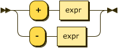
<map name="unary_expr.map">
    <area shape="rect" coords="119,1,167,33" href="#expr" title="expr">
</map>

<p>
    <div class="ebnf">
        <code>
            <div>
                EBNF: <a href="#unary_expr" title="unary_expr">unary_expr</a>
            </div>
            <div>
                &nbsp;&nbsp;&nbsp;&nbsp;&nbsp;&nbsp;&nbsp;&nbsp;&nbsp;::= ( '+' | '-' ) <a href="#expr" title="expr">expr</a>
            </div>
        </code>
    </div>
    <div class="ebnf">
        <code>
            <div>
                BNF: <a href="#unary_expr" title="unary_expr">unary_expr</a>
            </div>
            <div>
                &nbsp;&nbsp;&nbsp;&nbsp;&nbsp;&nbsp;&nbsp;&nbsp;&nbsp;::=
                '+' <a href="#expr" title="expr">expr</a>
            </div>
            <div>
                &nbsp;&nbsp;&nbsp;&nbsp;&nbsp;&nbsp;&nbsp;&nbsp;&nbsp;|
                '-' <a href="#expr" title="expr">expr</a>
            </div>
        </code>
    </div>
</p>

<p>referenced by:
    <ul>
        <li>
            <a href="#expr" title="expr">expr</a>
        </li>
    </ul>
</p><br><hr>

<p>
    <table class="signature" border="0">
        <tr>
            <td style="width: 100%">&nbsp;</td>
            <td valign="top">
                <nobr class="signature">... generated by
                    <a name="Railroad-Diagram-Generator" class="signature" title="https://bottlecaps.de/rr/ui#expression" href="https://bottlecaps.de/rr/ui#expression" target="_blank">RR - Railroad Diagram Generator</a>
                </nobr>
            </td>
            <td>
                <a name="Railroad-Diagram-Generator" title="https://bottlecaps.de/rr/ui#expression" href="https://bottlecaps.de/rr/ui#expression" target="_blank">
                </a>
            </td>
        </tr>
    </table>
</p>
</body>
</html>
