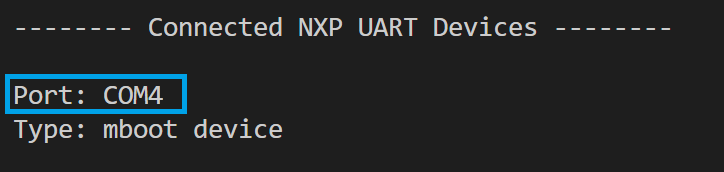

===================================
UART device identification in SPSDK
===================================

Devices connected to host PC using UART could be identified by *name* identifying serial port COMx
and *speed* defining baud rate, e.g. 9600, 57600, 115200.

    UART detection using `nxpdevscan`

----------------
UART under Linux
----------------

Several steps need to be performed before ``nxpdevscan`` and *SPSDK* can list and use NXP devices connected to the host PC under Linux.

By default on *Ubuntu* tty serial devices are only accessible to users in group *dialout*. The permissions for /dev/ttyACM0 can be permanently solved by adding the user to the *dialout* group:

.. code-block:: bash

    sudo usermod -a -G dialout $USER

Then the user has to perform logout and login from the system for the group changes to take effect. Afterward, the UART device is shown in ``nxpdevscan`` and ready for use.
