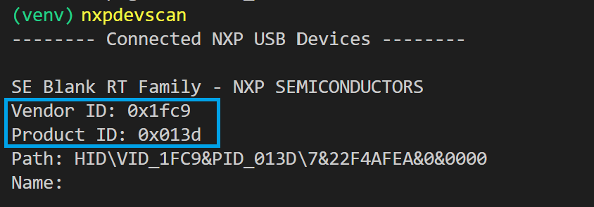
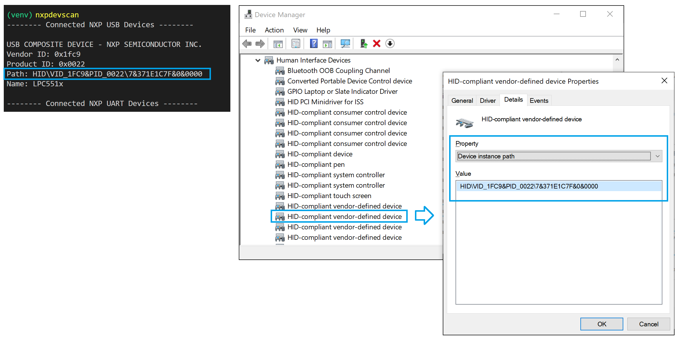
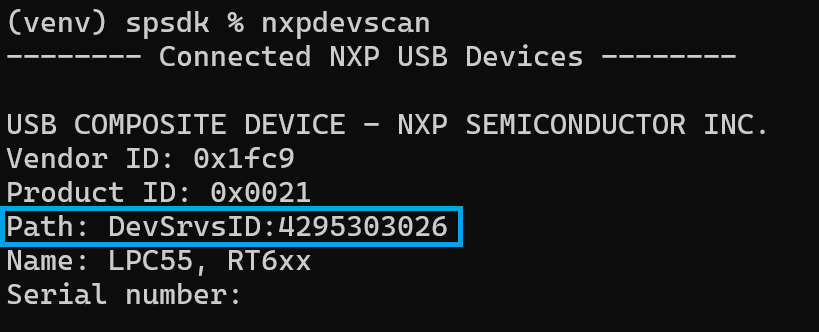

.. TODO: [SPSDK-722] Check reference in rst for usb and uart using include not toctree

==================================
USB device identification in SPSDK
==================================

In *SPSDK* apps such as ``blhost`` and ``sdphost`` communicate with NXP devices connected to host PC using USB. Such a devices could be identified by:

- *VID and PID*
- *Device Path*
- *Device Name*

---------------
USB - VID & PID
---------------

NXP devices use those VIDs:

- *0d28*
- *1fc9*
- *15a2*

Devices in *SPSDK* could be identified either by *VID only* or a combination of *VID/PID*.

*VID only* could be defined as hex or dec numbers. Hex number must be preceded by ``0x`` or ``0X``. The number of characters after ``0x`` is 1 - 4. Mixed upper & lower case letters is allowed, e.g. ``0xaB12``, ``0XAB12``, ``0x1``, ``0x0001``. The decimal number is restricted only to have 1 - 5 digits, e.g. ``65535``. It's allowed to set the USB filter ID to the decimal number ``99999``, however, as the USB VID number is a four-byte hex number (max value is 65535), this will lead to zero results. Leading zeros are not allowed e.g. 0001.

*VID/PID* cloud be separated by ':' or ','. The same rules apply to the number format as in the VID case, except, that the string consists of two numbers separated by ':' or ','. It's not allowed to mix hex and dec numbers, e.g. ``0xab12:12345``. Valid vid/pid strings: ``0x12aB:0xabc``, ``1,99999``.

    VID, PID detection using ``nxpdevscan``

-----------------
USB - Device Path
-----------------

*Device Path* holds the USB ID obtained during USB HID device search and allows to compare, whether the provided USB HID object is the one to be used.

.. note::

    The device path varies between OSes such as Windows, Linux, and Mac.

USB - Device Path - Windows
===========================

*Device Path* is a string in following format ``HID\\VID_<HEX>&PID_<HEX>\\<instance_id>``. The device path could be located in *Device Manager* or using ``nxpdevscan``.

    Device Path location using *Device Manager* or ``nxpdevscan``

USB - Device Path - Linux
=========================

*Device Path* is a path in the following form: ``0003:0002:00``.

The first number represents the ``Bus``, the second ``Device``, and the third ``Interface``. The ``Bus:Device`` number is unique and the ``Interface`` is not necessary.

The ``Bus:Device`` can be listed using ``lsusb`` command. The ``Interface`` can be observed using ``lsusb -t``. ``lsusb`` returns the ``Bus`` and ``Device`` as a 3-digit number. For the device identification in *SPSDK* ``<Bus in dec>#<Device in dec>``, e.g. ``3#11`` should be used.

.. figure:: ../_static/images/linux_usb_device_path_location.png
    :scale: 25 %
    :align: center

    Device Path location using ``nxpdevscan`` or ``lsusb``

.. note::

    For Applications and APIs to use connected devices under Linux, it is necessary to configure ``udev`` rules see :ref:`USB under Linux`.

USB - Device Path - Mac
=======================

*Device Path* is defined in following form:

.. code-block::

    IOService:/AppleACPIPlatformExpert/PCI0@0/AppleACPIPCI/XHC1@14/XHC1@14000000/HS01@14100000/SE Blank RT Family @14100000/IOUSBHostInterface@0/AppleUserUSBHostHIDDevice

*Device Path* could be found using the ``ioreg`` utility or using ``IO Hardware Registry Explorer`` tool. However, using the system report from ``About This MAC -> System Report -> USB`` a partial path can also be gathered. Using the name of the USB device from the ``USB Device Tree`` and appending the ``Location ID`` should work. The name can be ``SE Blank RT Family`` and the ``Location ID`` is in a form of <hex> / <dec>, e.g. ``0x14200000 / 18``. So the ``usb_id`` name should be ``SE Blank RT Family @14200000`` and the filter should be able to identify the required device.

    *Device Path* location using USB Device Tree or `nxpdevscan`

-----------------
USB - Device Name
-----------------

USB device could be identified in *SPSDK* by *Device Name*. *Device name* could be listed by *nxpdevscan*.

.. figure:: ../_static/images/nxpdevscan_usb_detect-device-path.png
    :scale: 50 %
    :align: center

    *Device Name* detection using `nxpdevscan`

