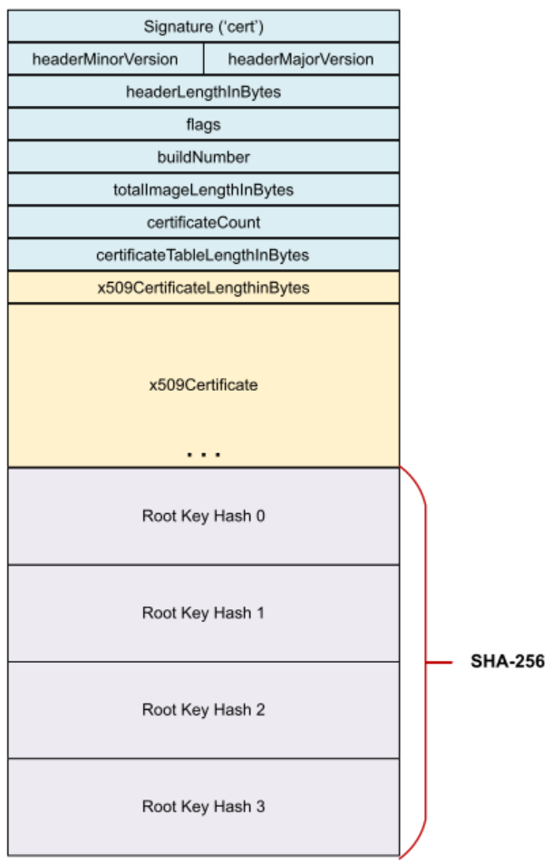
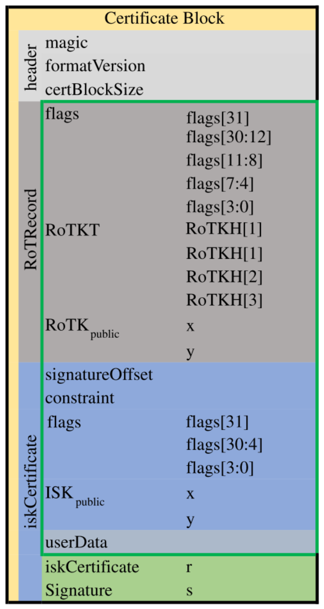

# Certificate Blocks

This document provides a comprehensive overview of the certificate blocks used in various NXP devices, specifically focusing on their role in secure boot and secure update processes. Certificate blocks are critical components in NXP's security architecture, serving as the cornerstone for establishing trust and ensuring the integrity of device firmware.

## Introduction to Certificate Blocks

Certificate blocks are sophisticated structures embedded within NXP devices that play a pivotal role in maintaining security throughout the device lifecycle. These blocks serve multiple crucial purposes:

1. Security: At their core, certificate blocks contain cryptographic signatures that enable the verification of firmware authenticity and integrity. This ensures that only authorized and unaltered firmware can be executed on the device, protecting against malicious code injection and unauthorized modifications.

2. Versioning: By incorporating version information, certificate blocks facilitate the tracking and management of different firmware iterations. This capability is essential for maintaining a secure and up-to-date device ecosystem, allowing for controlled firmware updates and preventing downgrade attacks.

3. Configuration: Certificate blocks store device-specific configuration data and settings, enabling customized security policies and feature sets tailored to specific device requirements or deployment scenarios.

4. Compliance: These blocks assist in meeting regulatory requirements and industry standards by providing a standardized mechanism for implementing and verifying security measures. This aspect is particularly important in sectors with stringent security and compliance regulations.

The evolution of certificate block versions reflects NXP's ongoing commitment to enhancing security, functionality, and compatibility across its diverse product lines. As threats evolve and security requirements become more stringent, NXP continually refines and improves its certificate block structures to provide robust protection against emerging vulnerabilities.

This document delves into the specifics of different certificate block versions, their structures, and their roles in secure boot and update processes. By understanding these components, developers, security engineers, and system integrators can effectively leverage NXP's security features to build resilient and trustworthy embedded systems.

## Certificate block Version 1 (v1)

Certificate block v1 represents NXP's first implementation of a structured certificate system for secure boot, based on X.509 certificates. As the pioneering version, it laid the groundwork for robust firmware authentication in NXP devices. This version introduced key concepts such as the certificate chain, allowing for flexible key management and enhanced security. It leverages RSA keys and X.509 standard certificates, providing a strong cryptographic foundation and compatibility with widely-used public key infrastructure. While now considered obsolete, v1 provided significant advantages in its time, including standardized certificate handling, support for multiple certificates, and a foundation for secure firmware updates. Its structure, based on industry-standard cryptographic practices and X.509 certificates, paved the way for future improvements in NXP's secure boot implementations, setting a baseline for security features that have evolved in subsequent versions.

- Structure:
  - Certificate block header
  - Certificate table
  - RKH table 

### Certificate Block Header

The Certificate Block Header is a critical component of the secure boot process, providing essential metadata and security parameters for image verification. It serves as the foundation for establishing trust and ensuring the authenticity of the firmware. By containing key information such as version numbers, image length, and certificate details, the header enables the bootloader to properly locate, parse, and validate the subsequent certificate chain and signed image data.

The header includes several important fields:
- signature: Always set to 'cert'
- headerVersion: Major version set to 1, minor version set to 0
- headerLengthInBytes: Number of bytes in the header, starting from the signature
- flags: Reserved for future use
- buildNumber: Used for firmware version rollback protection
- totalImageLengthInBytes: Length in bytes of the signed data
- certificateCount: Must be greater than 0
- certificateTableLengthInBytes: Total length in bytes of the certificate table

The signature field is a 4-character string 'cert' without a terminating null byte. The buildNumber is compared with OTP values during boot for rollback protection. Together, these fields form a comprehensive structure that ensures the integrity and authenticity of the firmware during the secure boot process.

### Certificate Table

The detailed information about the Certificate Table structure and requirements is essential for developers and engineers working with NXP devices that utilize this certificate block. This comprehensive overview ensures proper implementation of secure boot processes and correct creation and verification of certificate chains. It also guides compliance with NXP's security standards and facilitates effective management of cryptographic keys and certificates. By including this level of detail, the document serves as a valuable reference for anyone involved in firmware development, security implementation, or system integration for NXP devices using this certificate block structure. This knowledge is crucial for maintaining the integrity and security of the device's firmware and overall system.

- Follows immediately after the certificate block header
- Consists of a complete chain of one or more X.509 certificates
- Each certificate is prefixed with a length word (x509CertificateLengthInBytes)
- Structure:
  - Length word: Must be divisible by 4 (rounded up to 4-byte alignment)
  - X.509 certificate: Contains the actual certificate data (variable length)
  - Padding: 0-3 bytes may be inserted after the certificate data

- Certificate restrictions:
  - Only X.509 v3 format certificates are supported
  - Must be DER encoded
  - Must use RSA-2048, RSA-3072, or RSA-4096 and SHA-256
  - RSA key modulus bitlength must be greater than or equal to the security profile
  - The SHA-256 hash of the public key in the first certificate must be present in the RKH table

- Certificate chain order:
  - Starts with the root certificate
  - Followed by subsequent certificates in order of signing
  - The final certificate is the image signing certificate
  - Single self-signed certificate is allowed (must not be a CA)
  - For multiple certificates, the root must be self-signed and all but the last must be CAs

The total number of bytes in the table must equal certificateTableLengthInBytes and be divisible by 4.

### Supported Key Types
The v1 certificate block supports the following key type:
- RSA: 2048-bit and 4096-bit keys

## Certificate block Version 2.1 (v2.1)

Certificate block v2.1 is the most important part of SB3.1 and signed boot image. This version is designed specifically for elliptic curve cryptography (ECC) and plays a crucial role in establishing a secure chain of trust and ensuring firmware integrity and authenticity.

### Key Features
- Supports ECC (Elliptic Curve Cryptography) keys (NIST P-256 and P-384 curves)
- Requires 1 to 4 key pairs, based on secp256r1 or secp384r1
- EC types cannot be mixed (only secp256r1 or secp384r1 can be used)
- Hash algorithm selection based on the EC type used

### Certificate Block Header

The Certificate Block Header in v2.1 serves as a crucial component for secure boot, providing essential metadata and identifiers for the certificate block. It contains key information that allows the bootloader to verify and process the subsequent data correctly.

Key fields include:
 - **Magic Number**: Identifies the start of the certificate block (0x4E584346)
 - **Format Version**: Specifies the certificate block format version
 - **Certificate Block Size**: Total size of the certificate block

The Magic Number identifies the start of the certificate block, while the Format Version specifies the certificate block structure version. The Certificate Block Size indicates the total size of the block, allowing for proper memory allocation and data handling. The Reserved field provides flexibility for future expansions of the header structure.

### Root of Trust (RoT) Record

The Root of Trust (RoT) Record is a fundamental component of the v2.1 certificate block, establishing the foundation of trust for the entire secure boot process. It contains critical information for verifying the authenticity and integrity of the firmware.

The RoT Record structure comprises:

1. **flags**:
  - CA flag: 1 if root certificate is used to sign ISK key, 0 if used to sign image directly
  - Used root cert number: Specifies which root cert is used for ISK/image signature (0-3)
  - Type of root certificate: 0x1 for secp256r1, 0x2 for secp384r1

2. **RoTKT** (Root of Trust Keys Table):
  - Contains 1 to 4 RoTKH (Root of Trust Key Hash) records
  - Each RoTKH is either 32 bytes (SHA256 for secp256r1) or 48 bytes (SHA384 for secp384r1)
  - Hash digest of RoTKH records (RoTKTH) is stored in non-volatile memory of the device (Fuse, PFR)
  - If only one root certificate is used, RoTKTH is calculated as hash directly from the public key

3. **RoTKpublic** (Public Key of selected RoTK):
  - 64 bytes for secp256r1 or 96 bytes for secp384r1
  - Contains X and Y coordinates of the public key
  - This public key is used to verify the signature of the entire certificate block

### Optional ISK Certificate

The Optional Intermediate Signing Key (ISK) Certificate is present when an intermediate/image key is used in the signature chain. If ISK is not used, this section is removed from the Certificate block, and one of the provided root certificates is used for signing the whole Block 0 or boot image.

**Structure**
- signatureOffset: Offset in bytes to ISK certificate signature from the beginning of iskCertificate object
- constraint: Certificate version, compared with monotonic counter in fuses
- flags:
  - bit 31: User data flag (1 if user data included, 0 otherwise)
  - bits 3:0: Type of ISK certificate (0x1 for secp256r1, 0x2 for secp384r1)
- ISKpublic: ISK public key (big-endian)
  - secp256r1 if root is secp256r1
  - secp256r1 or secp384r1 if root is secp384r1
- userData: Optional, variable size (max 96 bytes)
- iskCertificate Signature:
  - ECDSA signature of SHA256 (for secp256r1) or SHA384 (for secp384r1) of certificate data
  - Signature stored in big-endian

The ISK EC type can have only the same or lower size compared to the root certificate. If RoTKs are based on secp256r1, then ISK can only be secp256r1. If root certificates are based on secp384r1, then secp256r1 or secp384r1 can be used for ISK.

The signature of the ISK certificate is done by hash calculation over RoTRecord and iskCertificate. The hash algorithm is selected based on the EC type of RoTK: SHA256 for secp256r1 or SHA384 for secp384r1.

### Signature Process

For ECDSA signatures in the certificate block:
- If secp256r1 curve is used for signing, SHA256 digest of signed data is used as input
- If secp384r1 curve is used for signing, SHA384 digest of signed data is used as input

The private part of the selected root key pair or ISK key pair needs to be provided as an external input for ECDSA signature of the boot image or Block 0.
