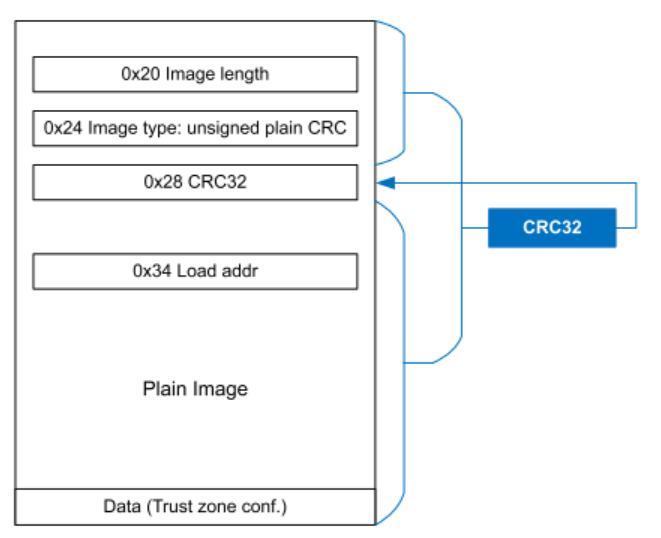
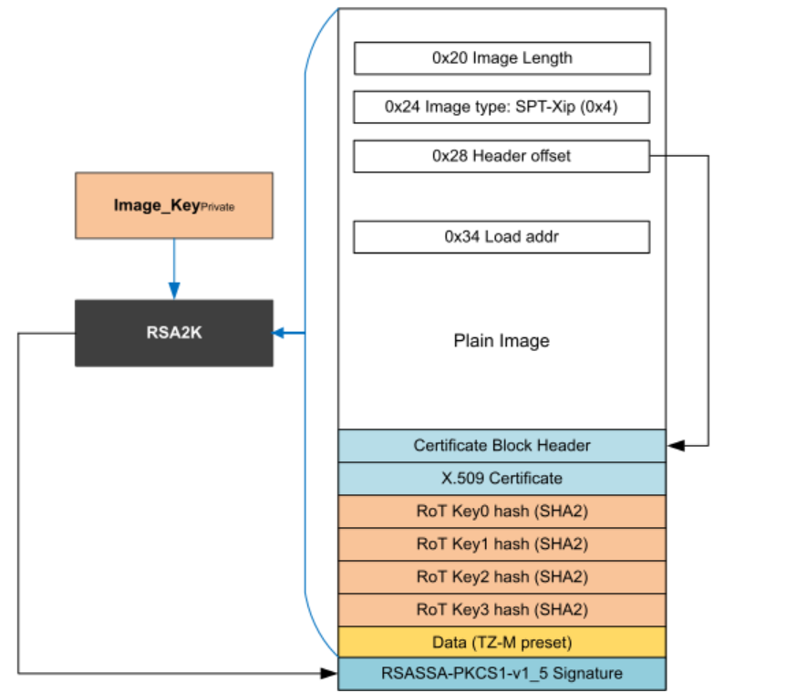
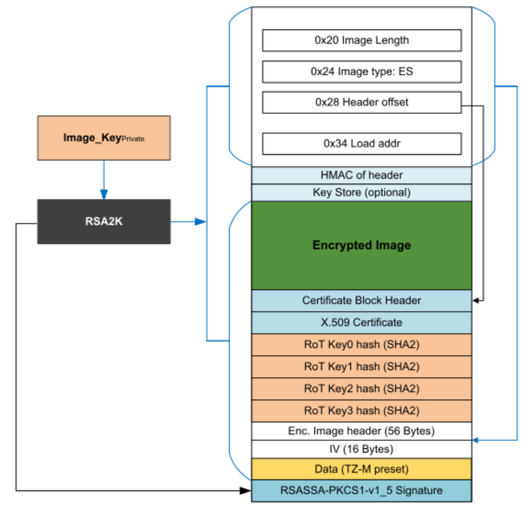

# Master Boot Image (MBI) Format

The Master Boot Image (MBI) is a boot format used in some NXP's Cortex-M microcontrollers. It provides a structured way to organize and load boot data, ensuring secure and efficient system initialization.

## Overview

The MBI format is designed to:
1. Provide a flexible boot structure
2. Support secure boot processes
3. The plain format is same as standard ARM Cortex-M boot format
## Structure

The MBI follows the standard ARM Cortex-M boot image structure, with enhancements:

1. **Vector Table**: Contains interrupt vectors, with unused vectors repurposed for MBI-specific information
2. **Firmware**: The actual application code
3. **Certificate Block**: (Optional) Contains security-related data for authenticated boot

This structure allows MBI to maintain compatibility with standard ARM Cortex-M boot processes while providing additional features for secure and flexible booting.

### MBI Header

The header utilizes the interrupt vector table of the original ARM Cortex-M image, repurposing unused vectors for MBI-specific information. It includes:

- Total image size (stored in an unused vector, Vector Index: 8) [0x00000020]
- Image type (stored in an unused vector, Vector Index: 9) [0x00000024]
- Optional CRC for integrity verification, or offset to certification block (stored in an unused vector, Vector Index: 10) [0x00000028]
- Load address (stored in an unused vector, Vector Index: 13) [0x00000034]

These fields are integrated into the standard vector table structure, maintaining compatibility with the ARM Cortex-M architecture while providing essential MBI-specific data.

#### Image type

The image type field is a crucial component of the MBI header, stored in one of the repurposed unused vectors of the ARM Cortex-M interrupt vector table. This field provides essential information about the structure and security features of the Master Boot Image.

Supported image types:
1. Plain MBI: The basic format without additional security features.
2. CRC MBI: Includes a Cyclic Redundancy Check for data integrity.
3. Signed MBI: Incorporates a digital signature for authenticity verification.
4. XIP MBI: Allows for eXecute-In-Place (XIP) operation.
5. Encrypted MBI: Provides confidentiality for the firmware image.
6. XIP CRC MBI: Combines XIP functionality with CRC integrity checking.

The image type field allows the bootloader to quickly determine how to process the image, whether it needs to perform integrity checks, verify signatures, decrypt the image, enable XIP functionality, or proceed with a straightforward boot process.

This field is essential for the flexible and secure boot process that the MBI format is designed to support, enabling different levels of security, integrity verification, and performance optimization based on the specific requirements of the application and the capabilities of the target microcontroller, such as the i.MX RT595.

The bootloader uses this information to properly handle the image during the boot process, ensuring that the appropriate security measures and boot procedures are applied according to the image type.

Additionally, the MBI format supports integration with keystore and TrustZone technologies:

- Keystore: For encrypted MBI types, the bootloader can utilize a secure keystore to manage and retrieve encryption keys. This enhances the security of the boot process by protecting sensitive key material.

- TrustZone: The MBI format can be used in conjunction with ARM TrustZone technology, allowing for the creation of secure and non-secure worlds. This enables the bootloader to load different parts of the firmware into appropriate security domains, further enhancing the overall system security.

These additional features provide developers with more options for implementing robust security measures in their embedded systems, particularly when dealing with sensitive data or in applications requiring high levels of security.
## MBI Types Specification

The MBI format supports different types to accommodate various security, integrity, and performance requirements:

1. **Plain MBI**: 
   - Basic format without additional security features
   - Suitable for non-sensitive applications or development purposes
   - Fastest boot time but least secure

2. **CRC MBI**:
   - Includes a Cyclic Redundancy Check (CRC) for data integrity
   - Detects accidental changes or corruption in the image
   - Provides a balance between security and boot speed
   
   

3. **Signed MBI**:
   - Incorporates a digital signature for authenticity verification
   - Ensures the image comes from a trusted source
   - Offers the highest level of security but may have slightly longer boot times
   
   

4. **XIP MBI**:
   - Allows for eXecute-In-Place (XIP) operation
   - Firmware can run directly from flash memory without being copied to RAM
   - Reduces boot time and RAM usage

5. **Encrypted MBI**:
   - Provides confidentiality for the firmware image
   - Protects intellectual property and prevents unauthorized access to code
   - Requires a secure key management system
   - Not supported on all families of NXP chips
   
   
   
6. **XIP CRC MBI**:
   - Combines XIP functionality with CRC integrity checking
   - Allows for execute-in-place operation while ensuring data integrity
   - Balances performance and basic security for XIP applications

Each type has its use case depending on the security, performance, and memory requirements of the application:
- Plain MBI for rapid prototyping and non-critical applications
- CRC MBI for applications requiring data integrity checks
- Signed MBI for secure and sensitive applications where authenticity is crucial
- XIP MBI for applications with limited RAM or requiring fast boot times
- Encrypted MBI for protecting sensitive code and intellectual property
- XIP CRC MBI for applications needing both XIP functionality and basic integrity checking
These MBI types provide developers with a wide range of options to tailor the boot process to their specific needs across different NXP microcontroller families, including the LPC55S3x, LPC55S69, and i.MX RT595.

## Boot Process

1. The bootloader reads the MBI header
2. It verifies the integrity of the image
3. If the MBI is encrypted:
   a. Decrypt the firmware
   b. Load decrypted firmware into specified memory locations
   Else:
   a. Load firmware into specified memory locations
5. Control is transferred to the loaded application

## Certificate Blocks

The MBI format supports Certificate Blocks, which are crucial for enhancing the security of the boot process. These blocks contain:

1. Root of Trust Public Key (ROTPK)
2. Image signing certificates
3. Image Signing Key (ISK) certificate

Certificate Blocks play a vital role in:
- Establishing a chain of trust
- Verifying the authenticity of the boot image
- Enabling secure boot mechanisms

The inclusion of Certificate Blocks allows for robust security measures, ensuring that only authorized and verified code is executed during the boot process.

The ISK certificate is specifically used for signing the image, providing an additional layer of security and authenticity verification in the boot process.

Both RSA and ECC keys are supported for use in Certificate Blocks, offering flexibility in cryptographic algorithms based on specific security requirements and performance considerations.

## Security Features

The MBI format supports secure boot by:
- Allowing for cryptographic signatures
- Supporting Cyclic Redundancy Checks (CRC) for data integrity
- Incorporating Certificate Blocks for establishing a chain of trust and verifying the authenticity of the boot image
- Enabling encrypted firmware images to protect sensitive code and intellectual property

## Advantages

- Flexibility in boot configurations
- Enhanced security for IoT and sensitive applications
- Streamlined firmware update process
- Compatibility across various NXP microcontroller families, with specific image type support varying by device

## Conclusion

The Master Boot Image format provides a robust and secure method for booting NXP microcontrollers, offering developers a powerful tool for system initialization and firmware management.
